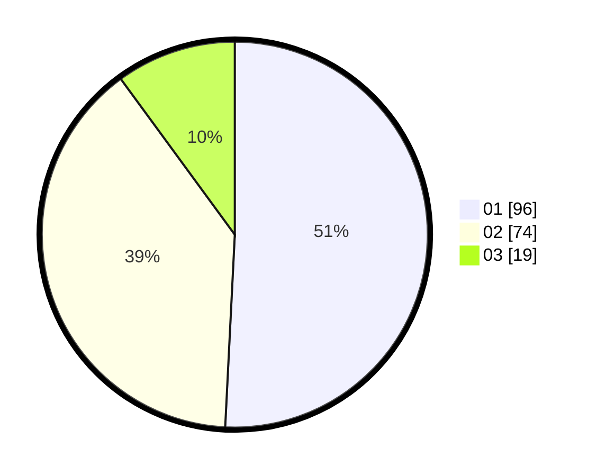

# Hasil

Hasil perolehan suara paslon dapat dilihat pada file paslon-01.txt, paslon-02.txt, dan paslon-03.txt.

Jika tidak ada, artinya data tersebut belum ada pada SIREKAP.

## Perolehan Suara

 * Paslon 01: **96**.
 * Paslon 02: **74**.
 * Paslon 03: **19**.

## Foto C Plano

https://sirekap-obj-formc.kpu.go.id/319a/pemilu/ppwp/31/75/10/10/06/3175101006070-20240214-201005--93fc8c60-71bd-442a-9cb0-5eaf08688c31.jpg

https://sirekap-obj-formc.kpu.go.id/319a/pemilu/ppwp/31/75/10/10/06/3175101006070-20240214-201045--78683df3-91b5-4c1c-9210-198eed058e28.jpg

https://sirekap-obj-formc.kpu.go.id/319a/pemilu/ppwp/31/75/10/10/06/3175101006070-20240214-201347--1ca7f57e-3a94-4d56-9430-832976b2f0f6.jpg

## DATA PEMILIH TETAP

Jumlah pemilih dalam DPT: **231**.
 * L: **110**.
 * P: **121**.

## DATA PENGGUNA HAK PILIH

Jumlah pengguna hak pilih dalam DPT: **184**.
 * L: **84**.
 * P: **100**.

Jumlah pengguna hak pilih dalam DPTb: **2**.
 * L: **1**.
 * P: **1**.

Jumlah pengguna hak pilih dalam DPK: **3**.
 * L: **1**.
 * P: **2**.

Jumlah pengguna hak pilih: **189**.
 * L: **86**.
 * P: **103**.

## JUMLAH SUARA SAH DAN TIDAK SAH

JUMLAH SELURUH SUARA SAH: **189**.

JUMLAH SUARA TIDAK SAH: **0**.

JUMLAH SELURUH SUARA SAH DAN SUARA TIDAK SAH: **189**.
