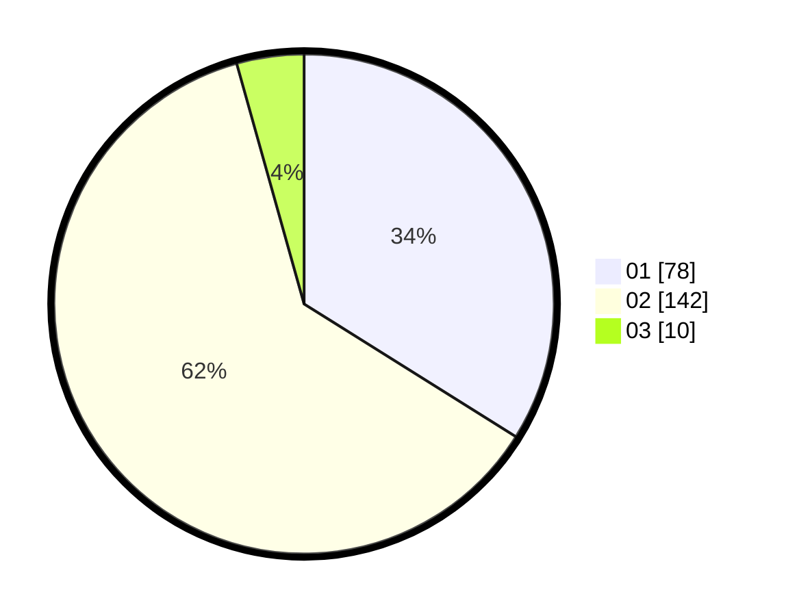

# Hasil

Hasil perolehan suara paslon dapat dilihat pada file paslon-01.txt, paslon-02.txt, dan paslon-03.txt.

Jika tidak ada, artinya data tersebut belum ada pada SIREKAP.

## Perolehan Suara

 * Paslon 01: **78**.
 * Paslon 02: **142**.
 * Paslon 03: **10**.

## Foto C Plano

https://sirekap-obj-formc.kpu.go.id/e326/pemilu/ppwp/31/75/10/10/06/3175101006077-20240214-203756--b639609d-2d6e-4447-b5f5-5e5e7a58d09c.jpg

https://sirekap-obj-formc.kpu.go.id/e326/pemilu/ppwp/31/75/10/10/06/3175101006077-20240214-203847--bfe578f2-7b2c-43ac-944e-7930df79778a.jpg

https://sirekap-obj-formc.kpu.go.id/e326/pemilu/ppwp/31/75/10/10/06/3175101006077-20240214-201254--6142dc5a-cc0b-400c-bffc-9235952ad5c2.jpg

## DATA PEMILIH TETAP

Jumlah pemilih dalam DPT: **260**.
 * L: **134**.
 * P: **126**.

## DATA PENGGUNA HAK PILIH

Jumlah pengguna hak pilih dalam DPT: **233**.
 * L: **119**.
 * P: **114**.

Jumlah pengguna hak pilih dalam DPTb: **0**.
 * L: **0**.
 * P: **0**.

Jumlah pengguna hak pilih dalam DPK: **2**.
 * L: **0**.
 * P: **2**.

Jumlah pengguna hak pilih: **235**.
 * L: **119**.
 * P: **116**.

## JUMLAH SUARA SAH DAN TIDAK SAH

JUMLAH SELURUH SUARA SAH: **230**.

JUMLAH SUARA TIDAK SAH: **5**.

JUMLAH SELURUH SUARA SAH DAN SUARA TIDAK SAH: **235**.
