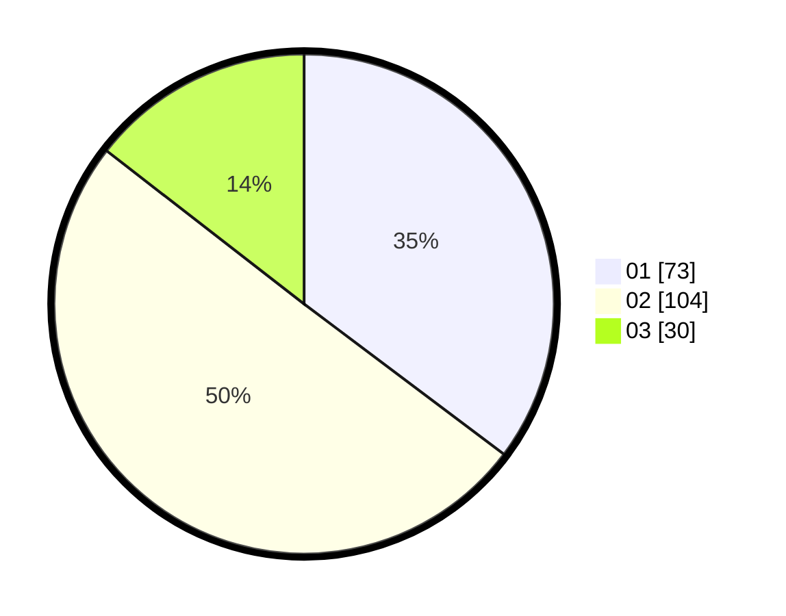

# Hasil

Hasil perolehan suara paslon dapat dilihat pada file paslon-01.txt, paslon-02.txt, dan paslon-03.txt.

Jika tidak ada, artinya data tersebut belum ada pada SIREKAP.

## Perolehan Suara

 * Paslon 01: **73**.
 * Paslon 02: **104**.
 * Paslon 03: **30**.

## Foto C Plano

https://sirekap-obj-formc.kpu.go.id/84ec/pemilu/ppwp/31/75/10/10/06/3175101006085-20240214-211535--91f77a65-c95e-4a9a-92ef-1871ddb63e96.jpg

https://sirekap-obj-formc.kpu.go.id/84ec/pemilu/ppwp/31/75/10/10/06/3175101006085-20240214-211551--1a2671f7-7bfe-4bfe-af17-16b2aa6c6e74.jpg

https://sirekap-obj-formc.kpu.go.id/84ec/pemilu/ppwp/31/75/10/10/06/3175101006085-20240214-211604--43b2f79e-10b6-49f1-a455-b54329f8b442.jpg

## DATA PEMILIH TETAP

Jumlah pemilih dalam DPT: **280**.
 * L: **129**.
 * P: **151**.

## DATA PENGGUNA HAK PILIH

Jumlah pengguna hak pilih dalam DPT: **205**.
 * L: **93**.
 * P: **112**.

Jumlah pengguna hak pilih dalam DPTb: **1**.
 * L: **1**.
 * P: **0**.

Jumlah pengguna hak pilih dalam DPK: **2**.
 * L: **1**.
 * P: **1**.

Jumlah pengguna hak pilih: **208**.
 * L: **95**.
 * P: **113**.

## JUMLAH SUARA SAH DAN TIDAK SAH

JUMLAH SELURUH SUARA SAH: **207**.

JUMLAH SUARA TIDAK SAH: **1**.

JUMLAH SELURUH SUARA SAH DAN SUARA TIDAK SAH: **208**.
