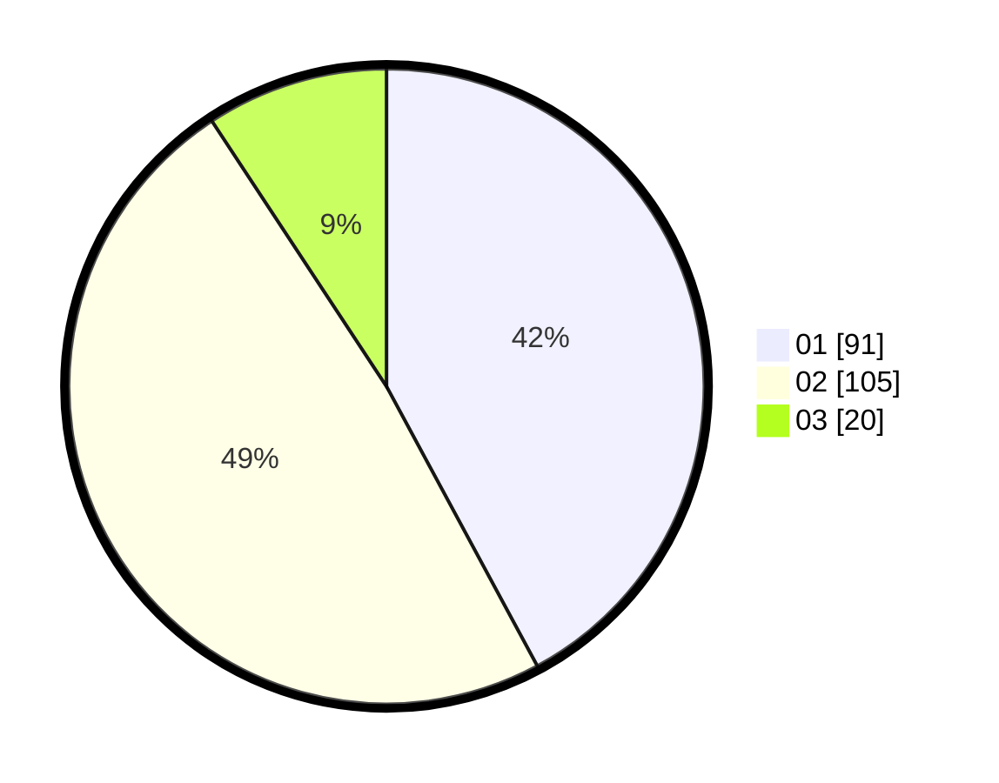

# Hasil

Hasil perolehan suara paslon dapat dilihat pada file paslon-01.txt, paslon-02.txt, dan paslon-03.txt.

Jika tidak ada, artinya data tersebut belum ada pada SIREKAP.

## Perolehan Suara

 * Paslon 01: **91**.
 * Paslon 02: **105**.
 * Paslon 03: **20**.

## Foto C Plano

https://sirekap-obj-formc.kpu.go.id/e14b/pemilu/ppwp/31/75/10/10/07/3175101007010-20240216-105748--655428f8-6641-47f6-a0df-cc45d125bc16.jpg

https://sirekap-obj-formc.kpu.go.id/e14b/pemilu/ppwp/31/75/10/10/07/3175101007010-20240216-105749--b39a1e9c-b6cd-4e97-9528-71aa26a7d0a7.jpg

https://sirekap-obj-formc.kpu.go.id/e14b/pemilu/ppwp/31/75/10/10/07/3175101007010-20240216-105749--8bad8424-43e7-4532-ae73-54b48f2435d3.jpg

## DATA PEMILIH TETAP

Jumlah pemilih dalam DPT: **271**.
 * L: **125**.
 * P: **146**.

## DATA PENGGUNA HAK PILIH

Jumlah pengguna hak pilih dalam DPT: **220**.
 * L: **98**.
 * P: **122**.

Jumlah pengguna hak pilih dalam DPTb: **0**.
 * L: **0**.
 * P: **0**.

Jumlah pengguna hak pilih dalam DPK: **0**.
 * L: **0**.
 * P: **0**.

Jumlah pengguna hak pilih: **220**.
 * L: **98**.
 * P: **122**.

## JUMLAH SUARA SAH DAN TIDAK SAH

JUMLAH SELURUH SUARA SAH: **216**.

JUMLAH SUARA TIDAK SAH: **4**.

JUMLAH SELURUH SUARA SAH DAN SUARA TIDAK SAH: **220**.
