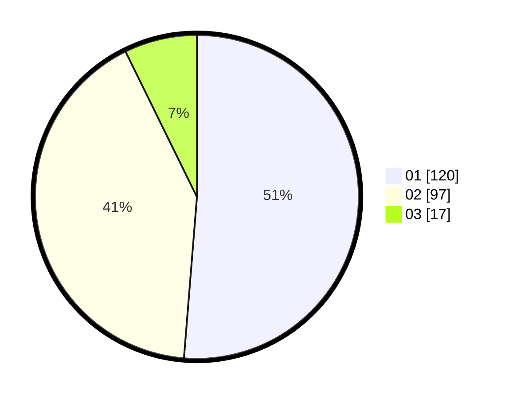

# Hasil

Hasil perolehan suara paslon dapat dilihat pada file paslon-01.txt, paslon-02.txt, dan paslon-03.txt.

Jika tidak ada, artinya data tersebut belum ada pada SIREKAP.

## Perolehan Suara

 * Paslon 01: **120**.
 * Paslon 02: **97**.
 * Paslon 03: **17**.

## Foto C Plano

https://sirekap-obj-formc.kpu.go.id/c861/pemilu/ppwp/31/75/10/10/07/3175101007018-20240216-013112--a758e1cd-19cc-4c42-b398-afd25ef8528d.jpg

https://sirekap-obj-formc.kpu.go.id/c861/pemilu/ppwp/31/75/10/10/07/3175101007018-20240216-013113--bd327453-b34c-4334-87c7-e1beb1085b2e.jpg

https://sirekap-obj-formc.kpu.go.id/c861/pemilu/ppwp/31/75/10/10/07/3175101007018-20240216-013112--25b9c122-fc59-48f4-83e7-e048d4a1085e.jpg

## DATA PEMILIH TETAP

Jumlah pemilih dalam DPT: **295**.
 * L: **144**.
 * P: **151**.

## DATA PENGGUNA HAK PILIH

Jumlah pengguna hak pilih dalam DPT: **235**.
 * L: **107**.
 * P: **128**.

Jumlah pengguna hak pilih dalam DPTb: **0**.
 * L: **0**.
 * P: **0**.

Jumlah pengguna hak pilih dalam DPK: **2**.
 * L: **0**.
 * P: **2**.

Jumlah pengguna hak pilih: **237**.
 * L: **107**.
 * P: **130**.

## JUMLAH SUARA SAH DAN TIDAK SAH

JUMLAH SELURUH SUARA SAH: **234**.

JUMLAH SUARA TIDAK SAH: **3**.

JUMLAH SELURUH SUARA SAH DAN SUARA TIDAK SAH: **237**.
