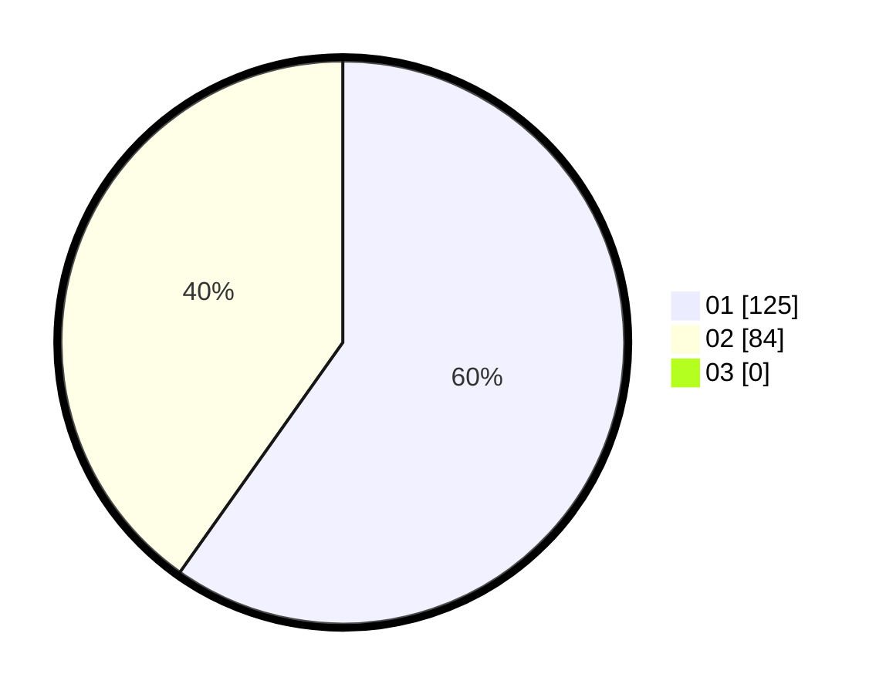

# Hasil

Hasil perolehan suara paslon dapat dilihat pada file paslon-01.txt, paslon-02.txt, dan paslon-03.txt.

Jika tidak ada, artinya data tersebut belum ada pada SIREKAP.

## Perolehan Suara

 * Paslon 01: **125**.
 * Paslon 02: **84**.
 * Paslon 03: **0**.

## Foto C Plano

https://sirekap-obj-formc.kpu.go.id/57ea/pemilu/ppwp/31/75/10/10/07/3175101007021-20240215-010207--151dee43-e254-457b-97dd-8468a83b0fb4.jpg

https://sirekap-obj-formc.kpu.go.id/57ea/pemilu/ppwp/31/75/10/10/07/3175101007021-20240215-010254--29e6ed87-6d04-4fae-9e41-9aef0419b7ac.jpg

https://sirekap-obj-formc.kpu.go.id/57ea/pemilu/ppwp/31/75/10/10/07/3175101007021-20240215-010324--9ed2d870-54dd-4882-bcd9-e19cc95f6a66.jpg
