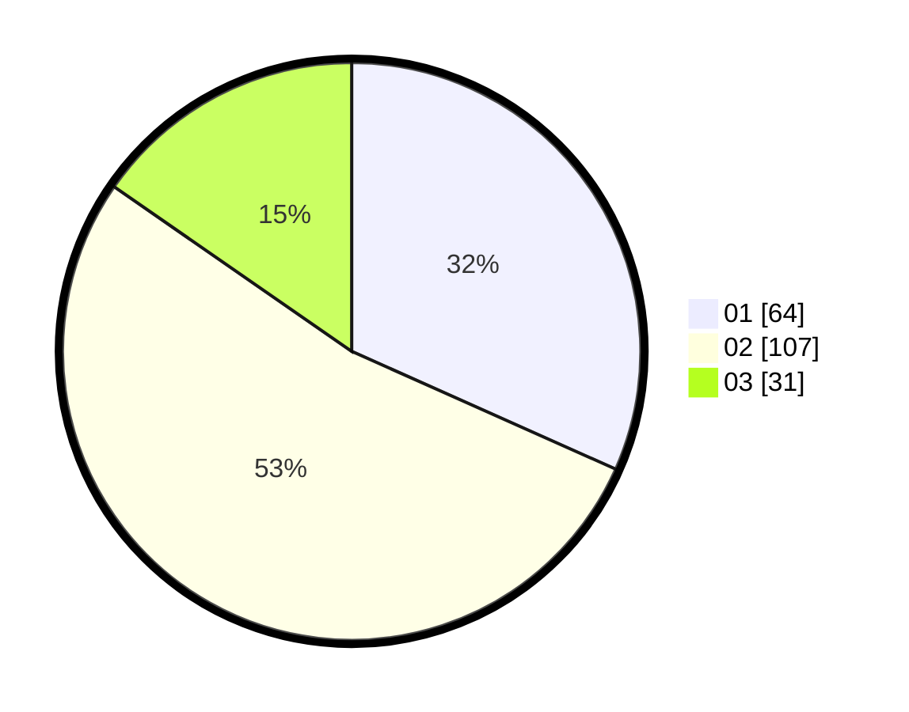

# Hasil

Hasil perolehan suara paslon dapat dilihat pada file paslon-01.txt, paslon-02.txt, dan paslon-03.txt.

Jika tidak ada, artinya data tersebut belum ada pada SIREKAP.

## Perolehan Suara

 * Paslon 01: **64**.
 * Paslon 02: **107**.
 * Paslon 03: **31**.

## Foto C Plano

https://sirekap-obj-formc.kpu.go.id/acf9/pemilu/ppwp/31/75/10/10/07/3175101007024-20240217-022904--43e4c0c5-6260-411c-9698-23288fd9c38e.jpg

https://sirekap-obj-formc.kpu.go.id/acf9/pemilu/ppwp/31/75/10/10/07/3175101007024-20240217-022905--5a4a3d3f-0f0c-46a3-aec3-c547c4dc5bc9.jpg

https://sirekap-obj-formc.kpu.go.id/acf9/pemilu/ppwp/31/75/10/10/07/3175101007024-20240217-022904--dab21712-95b0-4a68-b903-a7e8e62aaae9.jpg

## DATA PEMILIH TETAP

Jumlah pemilih dalam DPT: **272**.
 * L: **133**.
 * P: **139**.

## DATA PENGGUNA HAK PILIH

Jumlah pengguna hak pilih dalam DPT: **203**.
 * L: **96**.
 * P: **107**.

Jumlah pengguna hak pilih dalam DPTb: **0**.
 * L: **0**.
 * P: **0**.

Jumlah pengguna hak pilih dalam DPK: **3**.
 * L: **2**.
 * P: **1**.

Jumlah pengguna hak pilih: **206**.
 * L: **98**.
 * P: **108**.

## JUMLAH SUARA SAH DAN TIDAK SAH

JUMLAH SELURUH SUARA SAH: **202**.

JUMLAH SUARA TIDAK SAH: **4**.

JUMLAH SELURUH SUARA SAH DAN SUARA TIDAK SAH: **206**.
