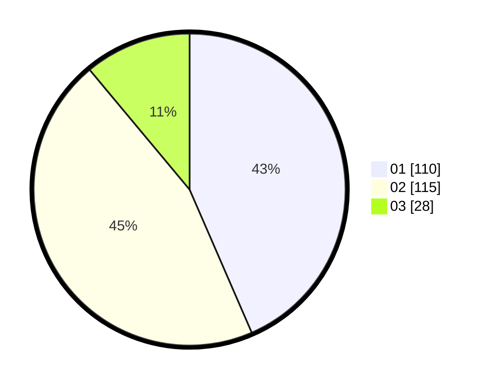

# Hasil

Hasil perolehan suara paslon dapat dilihat pada file paslon-01.txt, paslon-02.txt, dan paslon-03.txt.

Jika tidak ada, artinya data tersebut belum ada pada SIREKAP.

## Perolehan Suara

 * Paslon 01: **110**.
 * Paslon 02: **115**.
 * Paslon 03: **28**.

## Foto C Plano

https://sirekap-obj-formc.kpu.go.id/2a2e/pemilu/ppwp/31/75/10/10/07/3175101007030-20240216-200116--284e21c9-77f0-4f42-ae13-9b01a1921934.jpg

https://sirekap-obj-formc.kpu.go.id/2a2e/pemilu/ppwp/31/75/10/10/07/3175101007030-20240216-200118--5cba658a-62d5-49de-a08d-cabcb2766f8a.jpg

https://sirekap-obj-formc.kpu.go.id/2a2e/pemilu/ppwp/31/75/10/10/07/3175101007030-20240216-200117--b33fae4b-e42b-46c0-9320-e832fbc66fe3.jpg

## DATA PEMILIH TETAP

Jumlah pemilih dalam DPT: **292**.
 * L: **141**.
 * P: **151**.

## DATA PENGGUNA HAK PILIH

Jumlah pengguna hak pilih dalam DPT: **257**.
 * L: **121**.
 * P: **136**.

Jumlah pengguna hak pilih dalam DPTb: **0**.
 * L: **0**.
 * P: **0**.

Jumlah pengguna hak pilih dalam DPK: **0**.
 * L: **0**.
 * P: **0**.

Jumlah pengguna hak pilih: **257**.
 * L: **121**.
 * P: **136**.

## JUMLAH SUARA SAH DAN TIDAK SAH

JUMLAH SELURUH SUARA SAH: **253**.

JUMLAH SUARA TIDAK SAH: **4**.

JUMLAH SELURUH SUARA SAH DAN SUARA TIDAK SAH: **257**.
