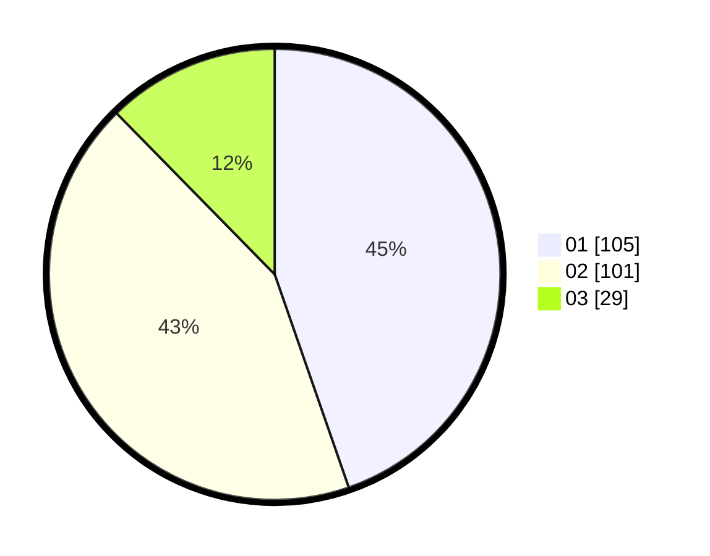

# Hasil

Hasil perolehan suara paslon dapat dilihat pada file paslon-01.txt, paslon-02.txt, dan paslon-03.txt.

Jika tidak ada, artinya data tersebut belum ada pada SIREKAP.

## Perolehan Suara

 * Paslon 01: **105**.
 * Paslon 02: **101**.
 * Paslon 03: **29**.

## Foto C Plano

https://sirekap-obj-formc.kpu.go.id/1442/pemilu/ppwp/31/75/10/10/07/3175101007031-20240216-225109--5e540ced-eaa1-4a72-adf0-855f4834a988.jpg

https://sirekap-obj-formc.kpu.go.id/1442/pemilu/ppwp/31/75/10/10/07/3175101007031-20240216-225110--638b402a-9f79-461b-aec8-69fe777ea1d2.jpg

https://sirekap-obj-formc.kpu.go.id/1442/pemilu/ppwp/31/75/10/10/07/3175101007031-20240216-225109--adc47bb5-345d-4263-b77f-2787651069ee.jpg

## DATA PEMILIH TETAP

Jumlah pemilih dalam DPT: **293**.
 * L: **126**.
 * P: **167**.

## DATA PENGGUNA HAK PILIH

Jumlah pengguna hak pilih dalam DPT: **233**.
 * L: **96**.
 * P: **137**.

Jumlah pengguna hak pilih dalam DPTb: **0**.
 * L: **0**.
 * P: **0**.

Jumlah pengguna hak pilih dalam DPK: **2**.
 * L: **1**.
 * P: **1**.

Jumlah pengguna hak pilih: **235**.
 * L: **97**.
 * P: **138**.

## JUMLAH SUARA SAH DAN TIDAK SAH

JUMLAH SELURUH SUARA SAH: **235**.

JUMLAH SUARA TIDAK SAH: **0**.

JUMLAH SELURUH SUARA SAH DAN SUARA TIDAK SAH: **235**.
