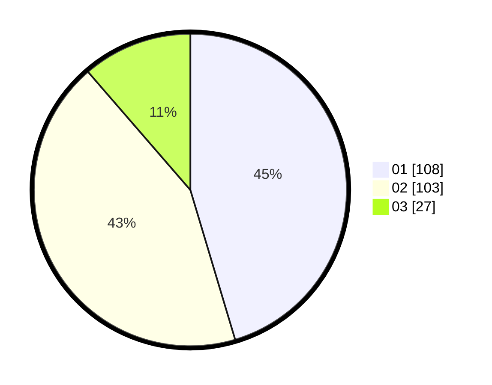

# Hasil

Hasil perolehan suara paslon dapat dilihat pada file paslon-01.txt, paslon-02.txt, dan paslon-03.txt.

Jika tidak ada, artinya data tersebut belum ada pada SIREKAP.

## Perolehan Suara

 * Paslon 01: **108**.
 * Paslon 02: **103**.
 * Paslon 03: **27**.

## Foto C Plano

https://sirekap-obj-formc.kpu.go.id/8ec7/pemilu/ppwp/31/75/10/10/07/3175101007034-20240214-222326--85787a5c-3ee1-4e4c-b517-9af70c76c1c9.jpg

https://sirekap-obj-formc.kpu.go.id/8ec7/pemilu/ppwp/31/75/10/10/07/3175101007034-20240214-222913--c85b160e-390b-420f-bfb8-818fe89226c1.jpg

https://sirekap-obj-formc.kpu.go.id/8ec7/pemilu/ppwp/31/75/10/10/07/3175101007034-20240214-222509--3cc8149a-e409-4b39-a8e5-9de56b91dcc4.jpg
