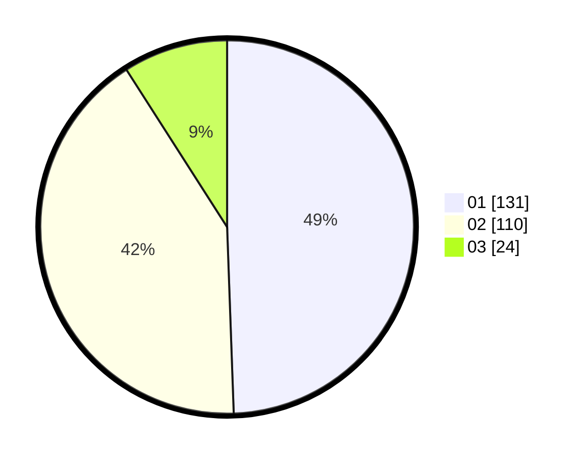

# Hasil

Hasil perolehan suara paslon dapat dilihat pada file paslon-01.txt, paslon-02.txt, dan paslon-03.txt.

Jika tidak ada, artinya data tersebut belum ada pada SIREKAP.

## Perolehan Suara

 * Paslon 01: **131**.
 * Paslon 02: **110**.
 * Paslon 03: **24**.

## Foto C Plano

https://sirekap-obj-formc.kpu.go.id/9b36/pemilu/ppwp/31/75/10/10/07/3175101007036-20240214-195450--ab18fa00-79ce-4f9d-9f4a-d9e7ef733238.jpg

https://sirekap-obj-formc.kpu.go.id/9b36/pemilu/ppwp/31/75/10/10/07/3175101007036-20240214-204036--666955b9-a589-4b0f-9f63-517b2073eafe.jpg

https://sirekap-obj-formc.kpu.go.id/9b36/pemilu/ppwp/31/75/10/10/07/3175101007036-20240214-204247--cbd3c3ca-2996-4d4f-a747-a0a24161fa8b.jpg

## DATA PEMILIH TETAP

Jumlah pemilih dalam DPT: **295**.
 * L: **153**.
 * P: **142**.

## DATA PENGGUNA HAK PILIH

Jumlah pengguna hak pilih dalam DPT: **262**.
 * L: **132**.
 * P: **130**.

Jumlah pengguna hak pilih dalam DPTb: **2**.
 * L: **1**.
 * P: **1**.

Jumlah pengguna hak pilih dalam DPK: **3**.
 * L: **1**.
 * P: **2**.

Jumlah pengguna hak pilih: **267**.
 * L: **134**.
 * P: **133**.

## JUMLAH SUARA SAH DAN TIDAK SAH

JUMLAH SELURUH SUARA SAH: **265**.

JUMLAH SUARA TIDAK SAH: **2**.

JUMLAH SELURUH SUARA SAH DAN SUARA TIDAK SAH: **267**.
