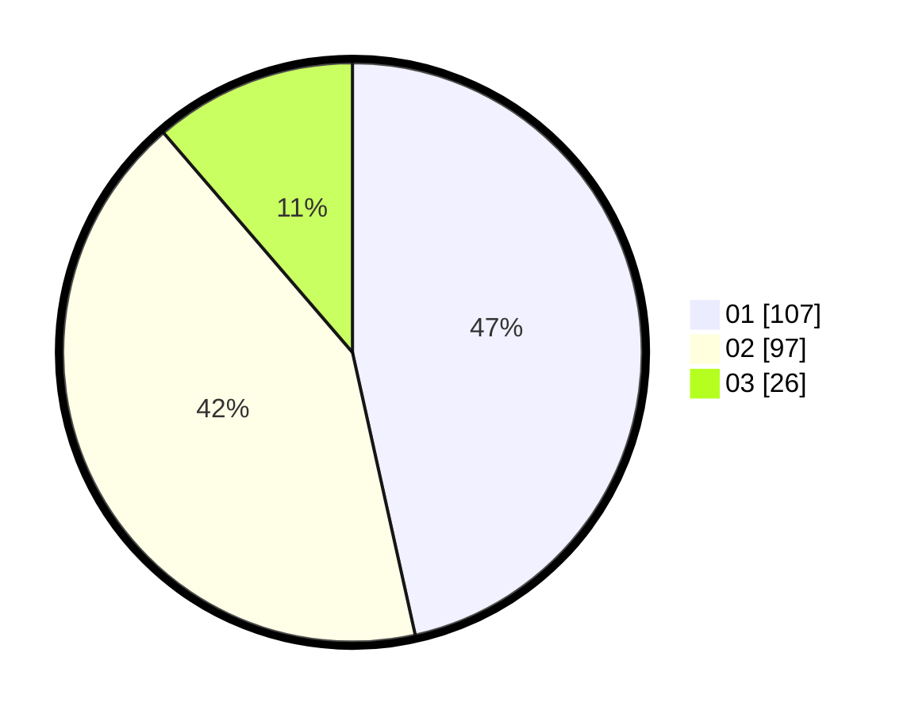

# Hasil

Hasil perolehan suara paslon dapat dilihat pada file paslon-01.txt, paslon-02.txt, dan paslon-03.txt.

Jika tidak ada, artinya data tersebut belum ada pada SIREKAP.

## Perolehan Suara

 * Paslon 01: **107**.
 * Paslon 02: **97**.
 * Paslon 03: **26**.

## Foto C Plano

https://sirekap-obj-formc.kpu.go.id/98b2/pemilu/ppwp/31/75/10/10/07/3175101007044-20240214-190354--c72c29f9-c6f7-4369-9c0b-b83604aaed8d.jpg

https://sirekap-obj-formc.kpu.go.id/98b2/pemilu/ppwp/31/75/10/10/07/3175101007044-20240214-185405--d952837b-73dd-441e-b073-5be327c55d0a.jpg

https://sirekap-obj-formc.kpu.go.id/98b2/pemilu/ppwp/31/75/10/10/07/3175101007044-20240214-185418--42899148-f1cd-41da-b36e-816dbc8e7f95.jpg
