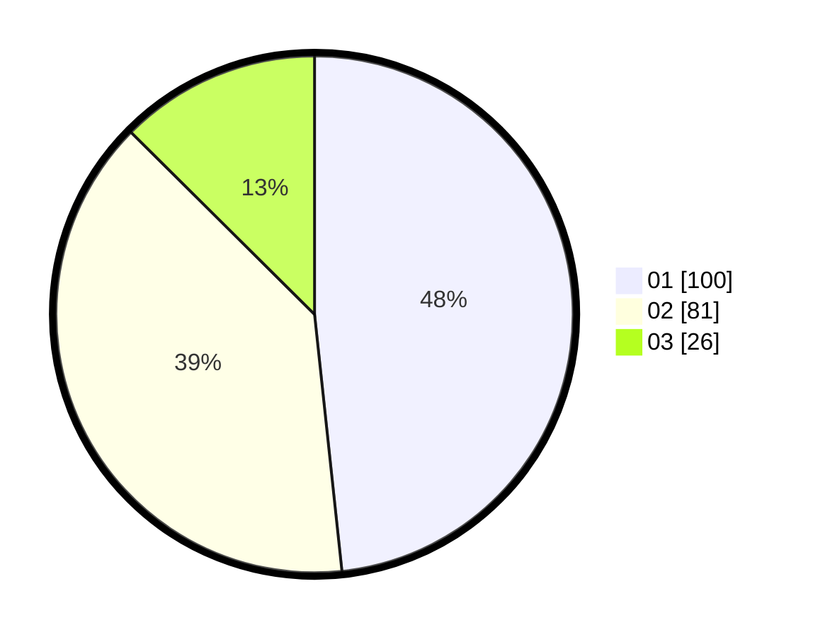

# Hasil

Hasil perolehan suara paslon dapat dilihat pada file paslon-01.txt, paslon-02.txt, dan paslon-03.txt.

Jika tidak ada, artinya data tersebut belum ada pada SIREKAP.

## Perolehan Suara

 * Paslon 01: **100**.
 * Paslon 02: **81**.
 * Paslon 03: **26**.

## Foto C Plano

https://sirekap-obj-formc.kpu.go.id/ba88/pemilu/ppwp/31/75/10/10/07/3175101007055-20240216-003322--8df6a89f-ede7-428a-b90c-54728d4e368d.jpg

https://sirekap-obj-formc.kpu.go.id/ba88/pemilu/ppwp/31/75/10/10/07/3175101007055-20240216-003328--e11005fe-d41c-4829-a766-fc4771a721b6.jpg

https://sirekap-obj-formc.kpu.go.id/ba88/pemilu/ppwp/31/75/10/10/07/3175101007055-20240216-003327--935dda0e-516d-4f06-9f76-996904168404.jpg

## DATA PEMILIH TETAP

Jumlah pemilih dalam DPT: **257**.
 * L: **114**.
 * P: **143**.

## DATA PENGGUNA HAK PILIH

Jumlah pengguna hak pilih dalam DPT: **206**.
 * L: **90**.
 * P: **116**.

Jumlah pengguna hak pilih dalam DPTb: **2**.
 * L: **1**.
 * P: **1**.

Jumlah pengguna hak pilih dalam DPK: **1**.
 * L: **1**.
 * P: **0**.

Jumlah pengguna hak pilih: **209**.
 * L: **92**.
 * P: **117**.

## JUMLAH SUARA SAH DAN TIDAK SAH

JUMLAH SELURUH SUARA SAH: **207**.

JUMLAH SUARA TIDAK SAH: **2**.

JUMLAH SELURUH SUARA SAH DAN SUARA TIDAK SAH: **209**.
