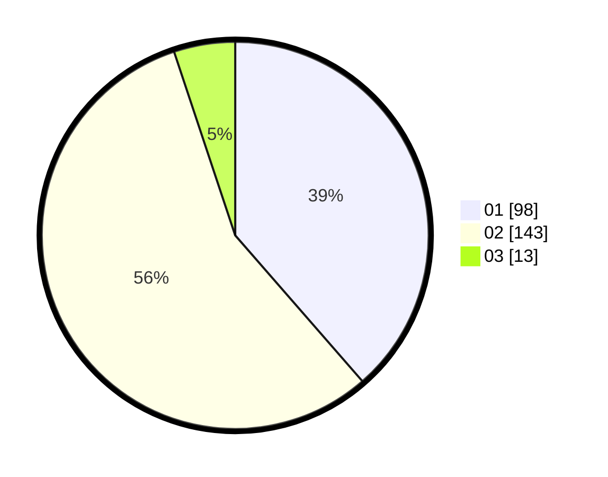

# Hasil

Hasil perolehan suara paslon dapat dilihat pada file paslon-01.txt, paslon-02.txt, dan paslon-03.txt.

Jika tidak ada, artinya data tersebut belum ada pada SIREKAP.

## Perolehan Suara

 * Paslon 01: **98**.
 * Paslon 02: **143**.
 * Paslon 03: **13**.

## Foto C Plano

https://sirekap-obj-formc.kpu.go.id/37e1/pemilu/ppwp/31/75/10/10/07/3175101007063-20240214-233052--62ff158a-2591-44d0-b042-cdbf3807ddef.jpg

https://sirekap-obj-formc.kpu.go.id/37e1/pemilu/ppwp/31/75/10/10/07/3175101007063-20240214-233409--d2547b23-b786-49ec-a65b-84e670661bfd.jpg

https://sirekap-obj-formc.kpu.go.id/37e1/pemilu/ppwp/31/75/10/10/07/3175101007063-20240214-160108--746cc341-6ded-4433-9502-7475caf8d11d.jpg

## DATA PEMILIH TETAP

Jumlah pemilih dalam DPT: **250**.
 * L: **114**.
 * P: **136**.

## DATA PENGGUNA HAK PILIH

Jumlah pengguna hak pilih dalam DPT: **250**.
 * L: **114**.
 * P: **136**.

Jumlah pengguna hak pilih dalam DPTb: **6**.
 * L: **0**.
 * P: **6**.

Jumlah pengguna hak pilih dalam DPK: **0**.
 * L: **0**.
 * P: **0**.

Jumlah pengguna hak pilih: **256**.
 * L: **114**.
 * P: **142**.

## JUMLAH SUARA SAH DAN TIDAK SAH

JUMLAH SELURUH SUARA SAH: **254**.

JUMLAH SUARA TIDAK SAH: **2**.

JUMLAH SELURUH SUARA SAH DAN SUARA TIDAK SAH: **256**.
