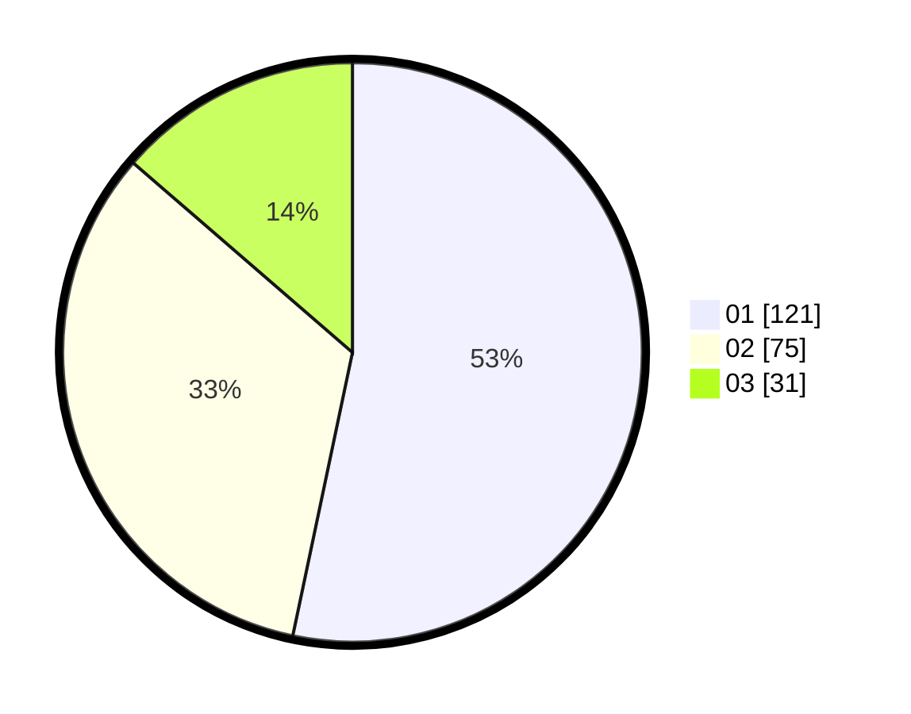

# Hasil

Hasil perolehan suara paslon dapat dilihat pada file paslon-01.txt, paslon-02.txt, dan paslon-03.txt.

Jika tidak ada, artinya data tersebut belum ada pada SIREKAP.

## Perolehan Suara

 * Paslon 01: **121**.
 * Paslon 02: **75**.
 * Paslon 03: **31**.

## Foto C Plano

https://sirekap-obj-formc.kpu.go.id/0d51/pemilu/ppwp/31/75/10/10/07/3175101007068-20240214-193632--aee6d615-19bf-48f3-9818-10bf666fcea1.jpg

https://sirekap-obj-formc.kpu.go.id/0d51/pemilu/ppwp/31/75/10/10/07/3175101007068-20240214-192745--e3b7eec9-16d6-49bc-942c-cee064a1d08d.jpg

https://sirekap-obj-formc.kpu.go.id/0d51/pemilu/ppwp/31/75/10/10/07/3175101007068-20240214-192320--4b5ccb87-5ef6-4917-a1a8-cea1b2bb8652.jpg

## DATA PEMILIH TETAP

Jumlah pemilih dalam DPT: **261**.
 * L: **124**.
 * P: **137**.

## DATA PENGGUNA HAK PILIH

Jumlah pengguna hak pilih dalam DPT: **229**.
 * L: **108**.
 * P: **121**.

Jumlah pengguna hak pilih dalam DPTb: **0**.
 * L: **0**.
 * P: **0**.

Jumlah pengguna hak pilih dalam DPK: **0**.
 * L: **0**.
 * P: **0**.

Jumlah pengguna hak pilih: **229**.
 * L: **108**.
 * P: **121**.

## JUMLAH SUARA SAH DAN TIDAK SAH

JUMLAH SELURUH SUARA SAH: **227**.

JUMLAH SUARA TIDAK SAH: **2**.

JUMLAH SELURUH SUARA SAH DAN SUARA TIDAK SAH: **229**.
