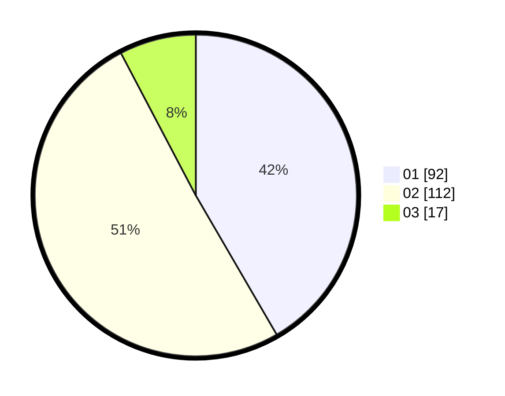

# Hasil

Hasil perolehan suara paslon dapat dilihat pada file paslon-01.txt, paslon-02.txt, dan paslon-03.txt.

Jika tidak ada, artinya data tersebut belum ada pada SIREKAP.

## Perolehan Suara

 * Paslon 01: **92**.
 * Paslon 02: **112**.
 * Paslon 03: **17**.

## Foto C Plano

https://sirekap-obj-formc.kpu.go.id/8d8b/pemilu/ppwp/31/75/10/10/07/3175101007069-20240215-004501--0ec0c2cb-5a8d-49f6-acd2-e5e0f92de784.jpg

https://sirekap-obj-formc.kpu.go.id/8d8b/pemilu/ppwp/31/75/10/10/07/3175101007069-20240214-195842--31c13977-d77c-4d31-b05f-8e4ffb27e338.jpg

https://sirekap-obj-formc.kpu.go.id/8d8b/pemilu/ppwp/31/75/10/10/07/3175101007069-20240215-004826--0ab49112-b9f3-4a77-846f-b6fee073a885.jpg
