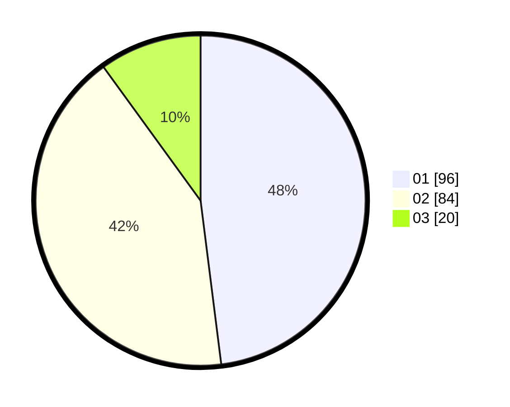

# Hasil

Hasil perolehan suara paslon dapat dilihat pada file paslon-01.txt, paslon-02.txt, dan paslon-03.txt.

Jika tidak ada, artinya data tersebut belum ada pada SIREKAP.

## Perolehan Suara

 * Paslon 01: **96**.
 * Paslon 02: **84**.
 * Paslon 03: **20**.

## Foto C Plano

https://sirekap-obj-formc.kpu.go.id/3196/pemilu/ppwp/31/75/10/10/07/3175101007071-20240216-152553--03a08433-8603-4b99-84ba-3ca79c67f750.jpg

https://sirekap-obj-formc.kpu.go.id/3196/pemilu/ppwp/31/75/10/10/07/3175101007071-20240216-152555--30d1de49-9c55-4b5f-a664-f2bcc08157ab.jpg

https://sirekap-obj-formc.kpu.go.id/3196/pemilu/ppwp/31/75/10/10/07/3175101007071-20240216-152554--ff2a1917-59e1-4f9e-9b70-d7d64450e448.jpg

## DATA PEMILIH TETAP

Jumlah pemilih dalam DPT: **262**.
 * L: **129**.
 * P: **133**.

## DATA PENGGUNA HAK PILIH

Jumlah pengguna hak pilih dalam DPT: **202**.
 * L: **95**.
 * P: **107**.

Jumlah pengguna hak pilih dalam DPTb: **0**.
 * L: **0**.
 * P: **0**.

Jumlah pengguna hak pilih dalam DPK: **0**.
 * L: **0**.
 * P: **0**.

Jumlah pengguna hak pilih: **202**.
 * L: **95**.
 * P: **107**.

## JUMLAH SUARA SAH DAN TIDAK SAH

JUMLAH SELURUH SUARA SAH: **200**.

JUMLAH SUARA TIDAK SAH: **2**.

JUMLAH SELURUH SUARA SAH DAN SUARA TIDAK SAH: **202**.
