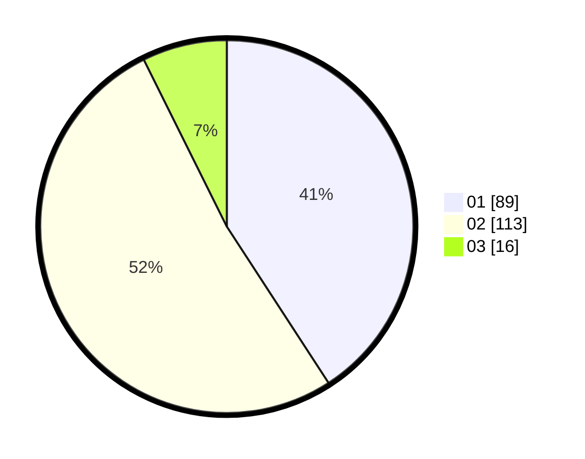

# Hasil

Hasil perolehan suara paslon dapat dilihat pada file paslon-01.txt, paslon-02.txt, dan paslon-03.txt.

Jika tidak ada, artinya data tersebut belum ada pada SIREKAP.

## Perolehan Suara

 * Paslon 01: **89**.
 * Paslon 02: **113**.
 * Paslon 03: **16**.

## Foto C Plano

https://sirekap-obj-formc.kpu.go.id/b25e/pemilu/ppwp/31/75/10/10/07/3175101007078-20240214-212130--b9c20890-7b64-48cc-a779-b62522e071d5.jpg

https://sirekap-obj-formc.kpu.go.id/b25e/pemilu/ppwp/31/75/10/10/07/3175101007078-20240214-212221--a3a7575f-b72a-44e3-917a-615a53c0d5f4.jpg

https://sirekap-obj-formc.kpu.go.id/b25e/pemilu/ppwp/31/75/10/10/07/3175101007078-20240214-212301--b6d73aa8-1b48-4cee-bd85-4df6014377dc.jpg
