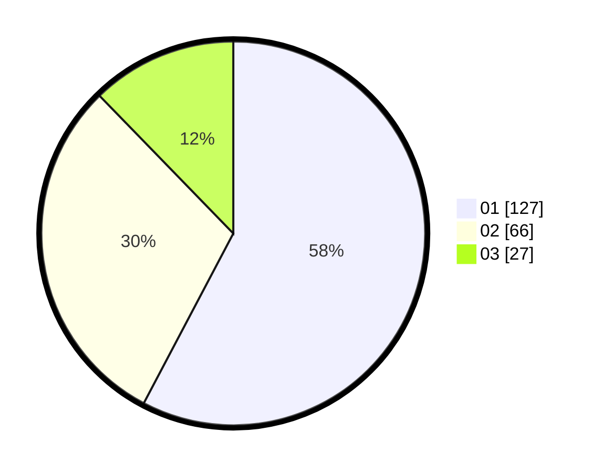

# Hasil

Hasil perolehan suara paslon dapat dilihat pada file paslon-01.txt, paslon-02.txt, dan paslon-03.txt.

Jika tidak ada, artinya data tersebut belum ada pada SIREKAP.

## Perolehan Suara

 * Paslon 01: **127**.
 * Paslon 02: **66**.
 * Paslon 03: **27**.

## Foto C Plano

https://sirekap-obj-formc.kpu.go.id/6330/pemilu/ppwp/31/75/10/10/07/3175101007082-20240216-022454--bc6d907f-9f20-47c9-aecb-347587bf9c90.jpg

https://sirekap-obj-formc.kpu.go.id/6330/pemilu/ppwp/31/75/10/10/07/3175101007082-20240216-022455--51419acd-67cc-4232-87b3-80262dc61157.jpg

https://sirekap-obj-formc.kpu.go.id/6330/pemilu/ppwp/31/75/10/10/07/3175101007082-20240216-022455--96efe1f7-ef8d-4bf1-a8b6-2ecf754565fc.jpg

## DATA PEMILIH TETAP

Jumlah pemilih dalam DPT: **259**.
 * L: **123**.
 * P: **136**.

## DATA PENGGUNA HAK PILIH

Jumlah pengguna hak pilih dalam DPT: **223**.
 * L: **101**.
 * P: **122**.

Jumlah pengguna hak pilih dalam DPTb: **2**.
 * L: **1**.
 * P: **1**.

Jumlah pengguna hak pilih dalam DPK: **0**.
 * L: **0**.
 * P: **0**.

Jumlah pengguna hak pilih: **225**.
 * L: **102**.
 * P: **123**.

## JUMLAH SUARA SAH DAN TIDAK SAH

JUMLAH SELURUH SUARA SAH: **220**.

JUMLAH SUARA TIDAK SAH: **5**.

JUMLAH SELURUH SUARA SAH DAN SUARA TIDAK SAH: **225**.
