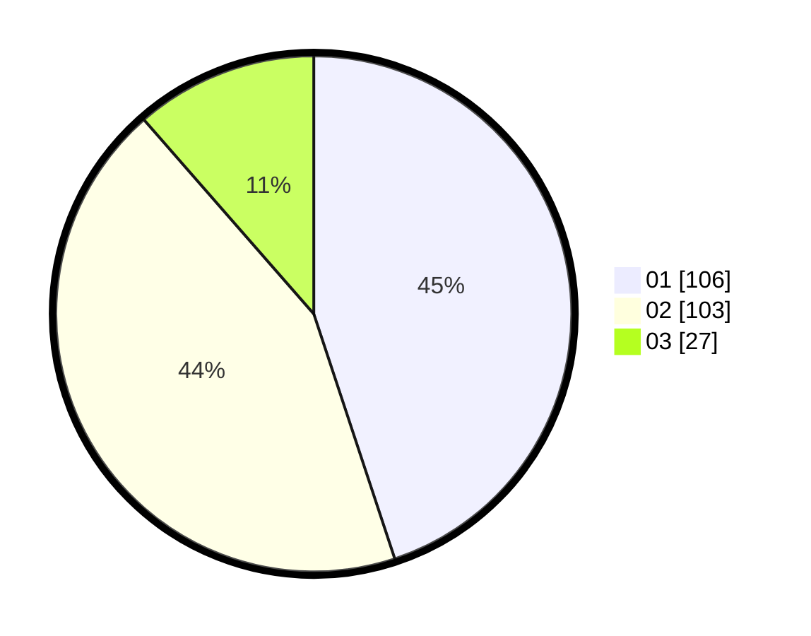

# Hasil

Hasil perolehan suara paslon dapat dilihat pada file paslon-01.txt, paslon-02.txt, dan paslon-03.txt.

Jika tidak ada, artinya data tersebut belum ada pada SIREKAP.

## Perolehan Suara

 * Paslon 01: **106**.
 * Paslon 02: **103**.
 * Paslon 03: **27**.

## Foto C Plano

https://sirekap-obj-formc.kpu.go.id/b5ca/pemilu/ppwp/31/75/10/10/07/3175101007086-20240216-034920--c1221f1a-35e1-4ee6-af25-da31ca1ebe50.jpg

https://sirekap-obj-formc.kpu.go.id/b5ca/pemilu/ppwp/31/75/10/10/07/3175101007086-20240216-034938--0a186187-be26-490f-a3c3-c855c2f6643b.jpg

https://sirekap-obj-formc.kpu.go.id/b5ca/pemilu/ppwp/31/75/10/10/07/3175101007086-20240216-034928--1f4a9e72-dd9b-4bdb-b843-cb993b5a34be.jpg

## DATA PEMILIH TETAP

Jumlah pemilih dalam DPT: **287**.
 * L: **138**.
 * P: **149**.

## DATA PENGGUNA HAK PILIH

Jumlah pengguna hak pilih dalam DPT: **236**.
 * L: **111**.
 * P: **125**.

Jumlah pengguna hak pilih dalam DPTb: **3**.
 * L: **1**.
 * P: **2**.

Jumlah pengguna hak pilih dalam DPK: **0**.
 * L: **0**.
 * P: **0**.

Jumlah pengguna hak pilih: **239**.
 * L: **112**.
 * P: **127**.

## JUMLAH SUARA SAH DAN TIDAK SAH

JUMLAH SELURUH SUARA SAH: **236**.

JUMLAH SUARA TIDAK SAH: **3**.

JUMLAH SELURUH SUARA SAH DAN SUARA TIDAK SAH: **239**.
