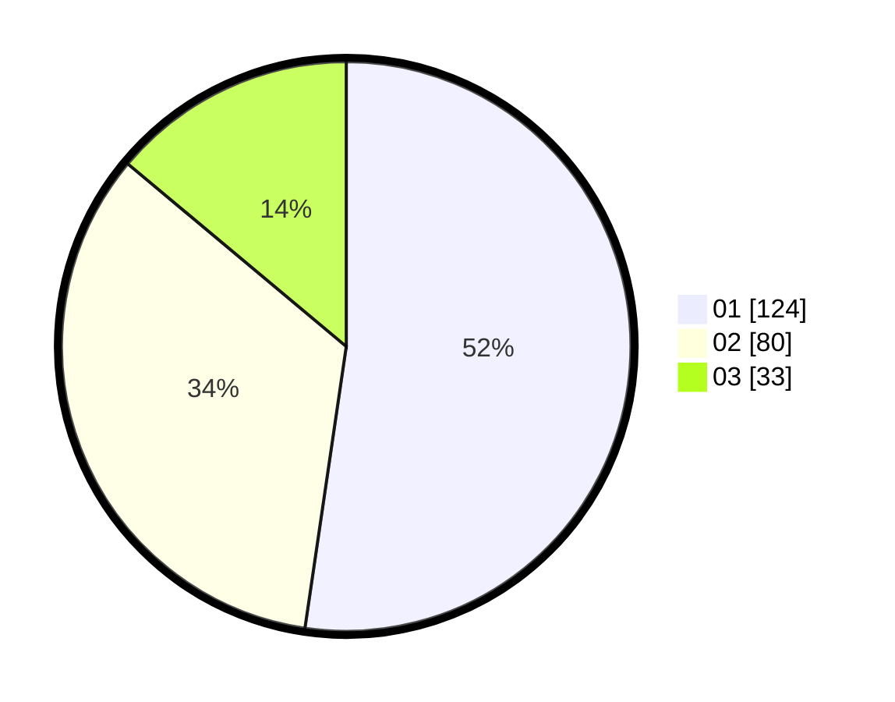

# Hasil

Hasil perolehan suara paslon dapat dilihat pada file paslon-01.txt, paslon-02.txt, dan paslon-03.txt.

Jika tidak ada, artinya data tersebut belum ada pada SIREKAP.

## Perolehan Suara

 * Paslon 01: **124**.
 * Paslon 02: **80**.
 * Paslon 03: **33**.

## Foto C Plano

https://sirekap-obj-formc.kpu.go.id/9fda/pemilu/ppwp/31/75/10/10/07/3175101007094-20240214-223227--aab80445-cd52-428f-85de-41f14eb96164.jpg

https://sirekap-obj-formc.kpu.go.id/9fda/pemilu/ppwp/31/75/10/10/07/3175101007094-20240214-223318--7b37c63b-2f98-4943-bc5b-79d9b3b512fb.jpg

https://sirekap-obj-formc.kpu.go.id/9fda/pemilu/ppwp/31/75/10/10/07/3175101007094-20240214-211019--fded9199-6e0d-4f9a-8d97-27bef624d373.jpg
