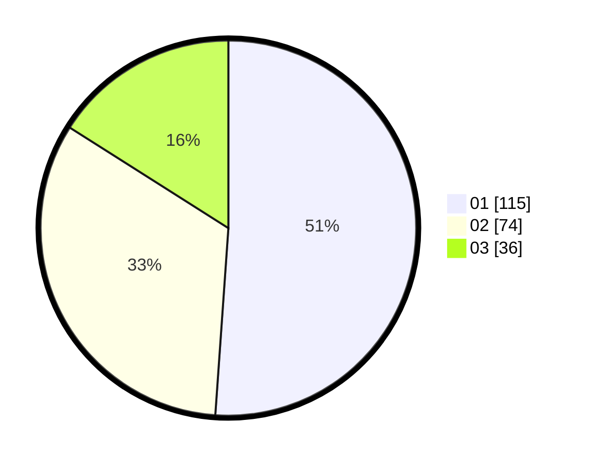

# Hasil

Hasil perolehan suara paslon dapat dilihat pada file paslon-01.txt, paslon-02.txt, dan paslon-03.txt.

Jika tidak ada, artinya data tersebut belum ada pada SIREKAP.

## Perolehan Suara

 * Paslon 01: **115**.
 * Paslon 02: **74**.
 * Paslon 03: **36**.

## Foto C Plano

https://sirekap-obj-formc.kpu.go.id/abe2/pemilu/ppwp/31/75/10/10/07/3175101007097-20240216-084131--7e1f18a9-a52d-44dd-99de-2c021c64d04b.jpg

https://sirekap-obj-formc.kpu.go.id/abe2/pemilu/ppwp/31/75/10/10/07/3175101007097-20240216-084144--c28aba06-b0db-4ae1-abef-736c8112732b.jpg

https://sirekap-obj-formc.kpu.go.id/abe2/pemilu/ppwp/31/75/10/10/07/3175101007097-20240216-084149--b21faf57-a8ba-48aa-ae30-6e407c8a8af2.jpg

## DATA PEMILIH TETAP

Jumlah pemilih dalam DPT: **293**.
 * L: **147**.
 * P: **146**.

## DATA PENGGUNA HAK PILIH

Jumlah pengguna hak pilih dalam DPT: **222**.
 * L: **104**.
 * P: **118**.

Jumlah pengguna hak pilih dalam DPTb: **1**.
 * L: **1**.
 * P: **0**.

Jumlah pengguna hak pilih dalam DPK: **3**.
 * L: **1**.
 * P: **2**.

Jumlah pengguna hak pilih: **226**.
 * L: **106**.
 * P: **120**.

## JUMLAH SUARA SAH DAN TIDAK SAH

JUMLAH SELURUH SUARA SAH: **225**.

JUMLAH SUARA TIDAK SAH: **1**.

JUMLAH SELURUH SUARA SAH DAN SUARA TIDAK SAH: **226**.
