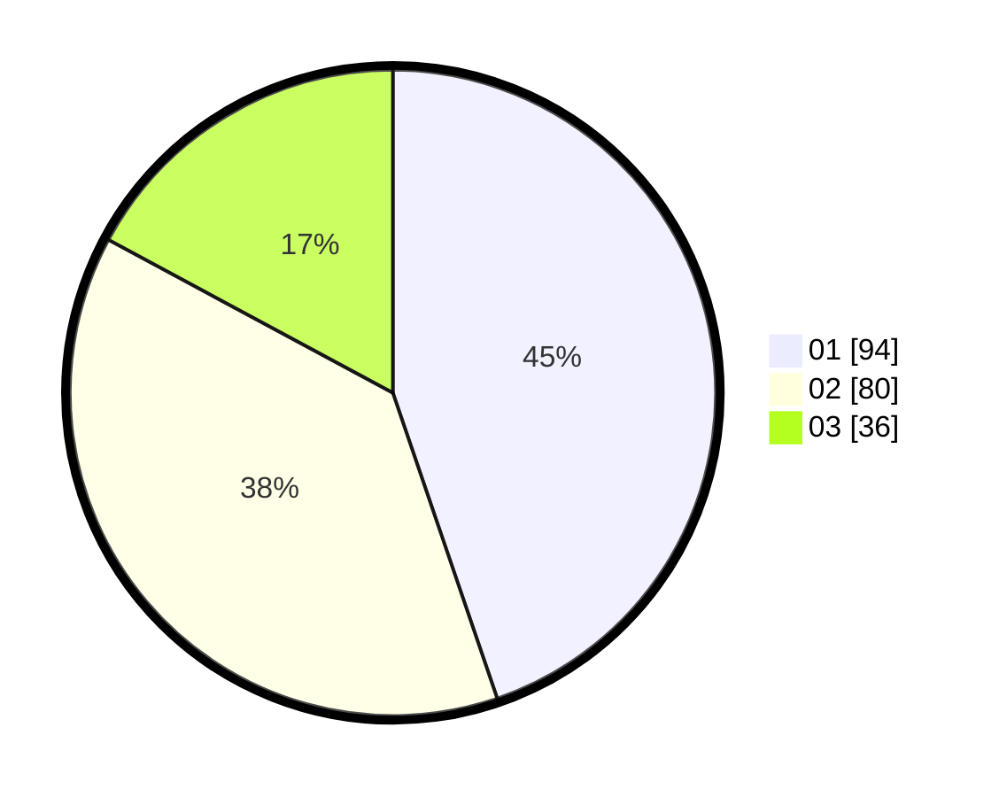

# Hasil

Hasil perolehan suara paslon dapat dilihat pada file paslon-01.txt, paslon-02.txt, dan paslon-03.txt.

Jika tidak ada, artinya data tersebut belum ada pada SIREKAP.

## Perolehan Suara

 * Paslon 01: **94**.
 * Paslon 02: **80**.
 * Paslon 03: **36**.

## Foto C Plano

https://sirekap-obj-formc.kpu.go.id/9750/pemilu/ppwp/31/75/10/10/07/3175101007100-20240214-205858--29b3ec90-c065-4557-ab46-2e25a8d879bd.jpg

https://sirekap-obj-formc.kpu.go.id/9750/pemilu/ppwp/31/75/10/10/07/3175101007100-20240214-155822--3557c59f-337e-4012-949c-eafb328e7bba.jpg

https://sirekap-obj-formc.kpu.go.id/9750/pemilu/ppwp/31/75/10/10/07/3175101007100-20240214-160104--721c66b5-5e7b-417a-b9eb-57fffc15436b.jpg

## DATA PEMILIH TETAP

Jumlah pemilih dalam DPT: **255**.
 * L: **129**.
 * P: **126**.

## DATA PENGGUNA HAK PILIH

Jumlah pengguna hak pilih dalam DPT: **209**.
 * L: **101**.
 * P: **108**.

Jumlah pengguna hak pilih dalam DPTb: **3**.
 * L: **2**.
 * P: **1**.

Jumlah pengguna hak pilih dalam DPK: **0**.
 * L: **0**.
 * P: **0**.

Jumlah pengguna hak pilih: **212**.
 * L: **103**.
 * P: **109**.

## JUMLAH SUARA SAH DAN TIDAK SAH

JUMLAH SELURUH SUARA SAH: **210**.

JUMLAH SUARA TIDAK SAH: **2**.

JUMLAH SELURUH SUARA SAH DAN SUARA TIDAK SAH: **212**.
