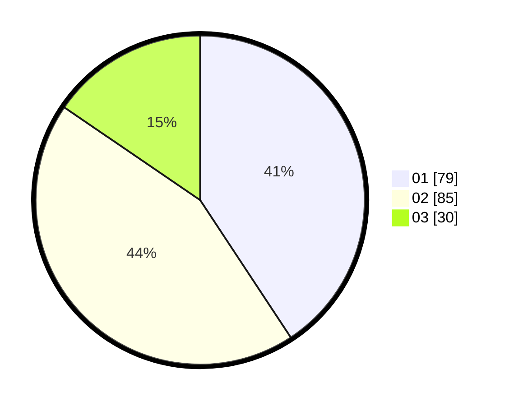

# Hasil

Hasil perolehan suara paslon dapat dilihat pada file paslon-01.txt, paslon-02.txt, dan paslon-03.txt.

Jika tidak ada, artinya data tersebut belum ada pada SIREKAP.

## Perolehan Suara

 * Paslon 01: **79**.
 * Paslon 02: **85**.
 * Paslon 03: **30**.

## Foto C Plano

https://sirekap-obj-formc.kpu.go.id/9968/pemilu/ppwp/31/75/10/10/07/3175101007101-20240215-011837--6e3e813c-60f7-4701-ad03-3c80b6469c16.jpg

https://sirekap-obj-formc.kpu.go.id/9968/pemilu/ppwp/31/75/10/10/07/3175101007101-20240214-194605--cbbc332e-623e-4f32-8fe1-d9b580f34448.jpg

https://sirekap-obj-formc.kpu.go.id/9968/pemilu/ppwp/31/75/10/10/07/3175101007101-20240215-012336--969fbc32-79f4-4a93-bc3b-99663f277e24.jpg
