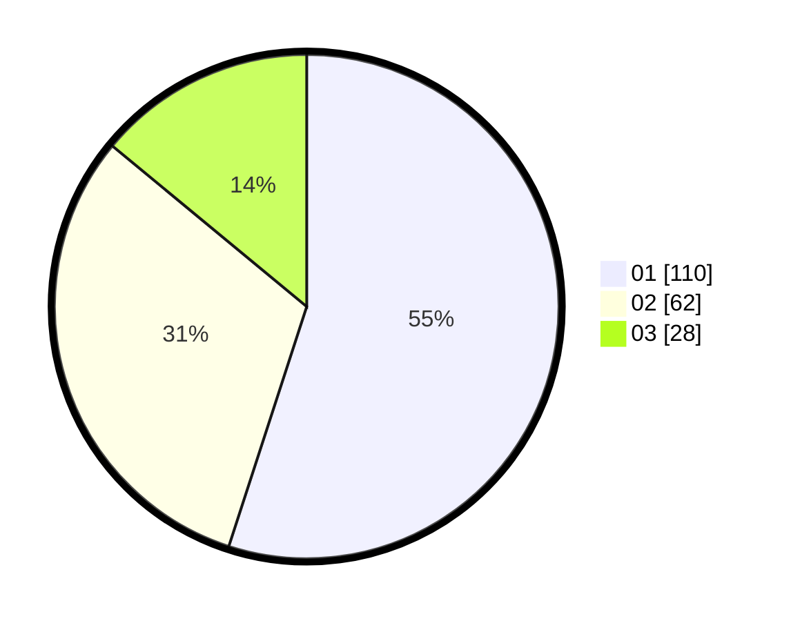

# Hasil

Hasil perolehan suara paslon dapat dilihat pada file paslon-01.txt, paslon-02.txt, dan paslon-03.txt.

Jika tidak ada, artinya data tersebut belum ada pada SIREKAP.

## Perolehan Suara

 * Paslon 01: **110**.
 * Paslon 02: **62**.
 * Paslon 03: **28**.

## Foto C Plano

https://sirekap-obj-formc.kpu.go.id/fc20/pemilu/ppwp/31/75/10/10/07/3175101007102-20240216-193337--5fcf1ed3-c2c8-4de6-b8c4-26c48310ee67.jpg

https://sirekap-obj-formc.kpu.go.id/fc20/pemilu/ppwp/31/75/10/10/07/3175101007102-20240216-185657--a4bb323b-09f6-4472-8567-601546681a3c.jpg

https://sirekap-obj-formc.kpu.go.id/fc20/pemilu/ppwp/31/75/10/10/07/3175101007102-20240216-185919--5ee6ac09-f660-4844-88b4-811baafa63f3.jpg

## DATA PEMILIH TETAP

Jumlah pemilih dalam DPT: **256**.
 * L: **117**.
 * P: **139**.

## DATA PENGGUNA HAK PILIH

Jumlah pengguna hak pilih dalam DPT: **202**.
 * L: **87**.
 * P: **115**.

Jumlah pengguna hak pilih dalam DPTb: **1**.
 * L: **1**.
 * P: **0**.

Jumlah pengguna hak pilih dalam DPK: **1**.
 * L: **1**.
 * P: **0**.

Jumlah pengguna hak pilih: **204**.
 * L: **89**.
 * P: **115**.

## JUMLAH SUARA SAH DAN TIDAK SAH

JUMLAH SELURUH SUARA SAH: **200**.

JUMLAH SUARA TIDAK SAH: **4**.

JUMLAH SELURUH SUARA SAH DAN SUARA TIDAK SAH: **204**.
