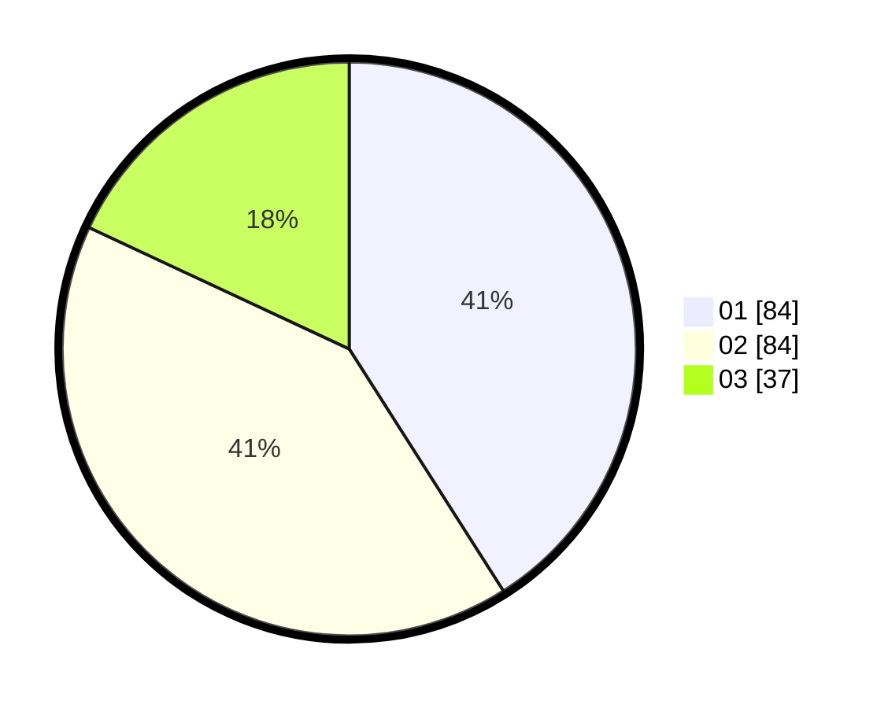

# Hasil

Hasil perolehan suara paslon dapat dilihat pada file paslon-01.txt, paslon-02.txt, dan paslon-03.txt.

Jika tidak ada, artinya data tersebut belum ada pada SIREKAP.

## Perolehan Suara

 * Paslon 01: **84**.
 * Paslon 02: **84**.
 * Paslon 03: **37**.

## Foto C Plano

https://sirekap-obj-formc.kpu.go.id/374e/pemilu/ppwp/31/75/10/10/07/3175101007104-20240216-150142--29f232c7-ffcb-45d2-a47f-c9a3264ac3ba.jpg

https://sirekap-obj-formc.kpu.go.id/374e/pemilu/ppwp/31/75/10/10/07/3175101007104-20240216-150142--c2cca6a5-e004-4188-ae75-4a08c112be71.jpg

https://sirekap-obj-formc.kpu.go.id/374e/pemilu/ppwp/31/75/10/10/07/3175101007104-20240214-155438--8fad0656-a246-40b2-b6b4-259d9fc8a308.jpg

## DATA PEMILIH TETAP

Jumlah pemilih dalam DPT: **257**.
 * L: **123**.
 * P: **134**.

## DATA PENGGUNA HAK PILIH

Jumlah pengguna hak pilih dalam DPT: **205**.
 * L: **94**.
 * P: **111**.

Jumlah pengguna hak pilih dalam DPTb: **0**.
 * L: **0**.
 * P: **0**.

Jumlah pengguna hak pilih dalam DPK: **2**.
 * L: **1**.
 * P: **1**.

Jumlah pengguna hak pilih: **207**.
 * L: **95**.
 * P: **112**.

## JUMLAH SUARA SAH DAN TIDAK SAH

JUMLAH SELURUH SUARA SAH: **205**.

JUMLAH SUARA TIDAK SAH: **2**.

JUMLAH SELURUH SUARA SAH DAN SUARA TIDAK SAH: **207**.
