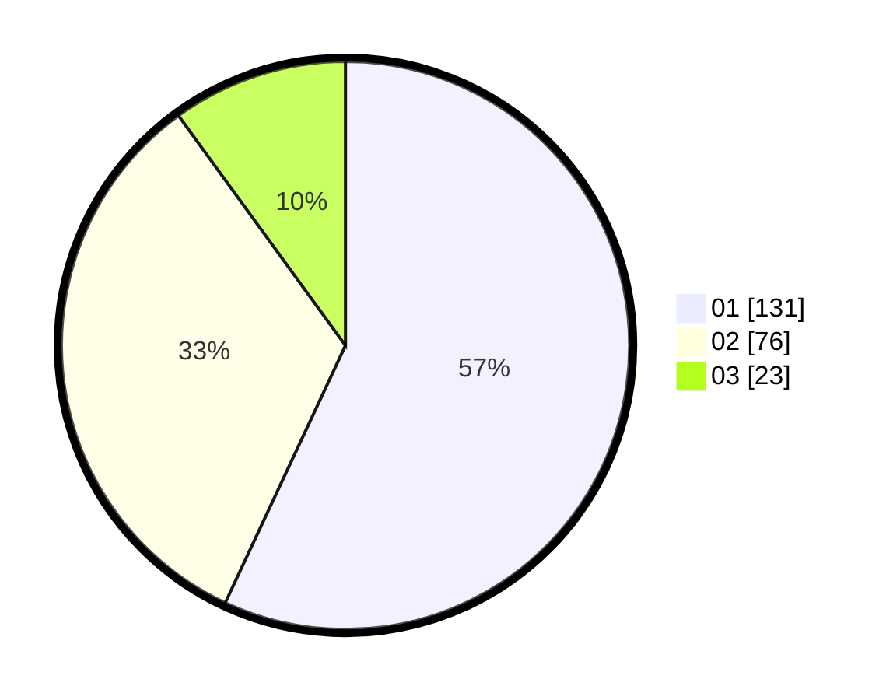

# Hasil

Hasil perolehan suara paslon dapat dilihat pada file paslon-01.txt, paslon-02.txt, dan paslon-03.txt.

Jika tidak ada, artinya data tersebut belum ada pada SIREKAP.

## Perolehan Suara

 * Paslon 01: **131**.
 * Paslon 02: **76**.
 * Paslon 03: **23**.

## Foto C Plano

https://sirekap-obj-formc.kpu.go.id/22b1/pemilu/ppwp/31/75/10/10/07/3175101007107-20240214-155201--d4ee7148-225e-469c-9ca8-09f8ad6a7a6d.jpg

https://sirekap-obj-formc.kpu.go.id/22b1/pemilu/ppwp/31/75/10/10/07/3175101007107-20240214-155150--7c2bd5a6-cb39-4bf3-9081-3c82fcc9deb2.jpg

https://sirekap-obj-formc.kpu.go.id/22b1/pemilu/ppwp/31/75/10/10/07/3175101007107-20240214-155849--96666f07-c2f0-472f-a7fc-f16e56ba0350.jpg

## DATA PEMILIH TETAP

Jumlah pemilih dalam DPT: **261**.
 * L: **125**.
 * P: **136**.

## DATA PENGGUNA HAK PILIH

Jumlah pengguna hak pilih dalam DPT: **227**.
 * L: **106**.
 * P: **121**.

Jumlah pengguna hak pilih dalam DPTb: **0**.
 * L: **0**.
 * P: **0**.

Jumlah pengguna hak pilih dalam DPK: **5**.
 * L: **4**.
 * P: **1**.

Jumlah pengguna hak pilih: **232**.
 * L: **110**.
 * P: **122**.

## JUMLAH SUARA SAH DAN TIDAK SAH

JUMLAH SELURUH SUARA SAH: **230**.

JUMLAH SUARA TIDAK SAH: **2**.

JUMLAH SELURUH SUARA SAH DAN SUARA TIDAK SAH: **232**.
