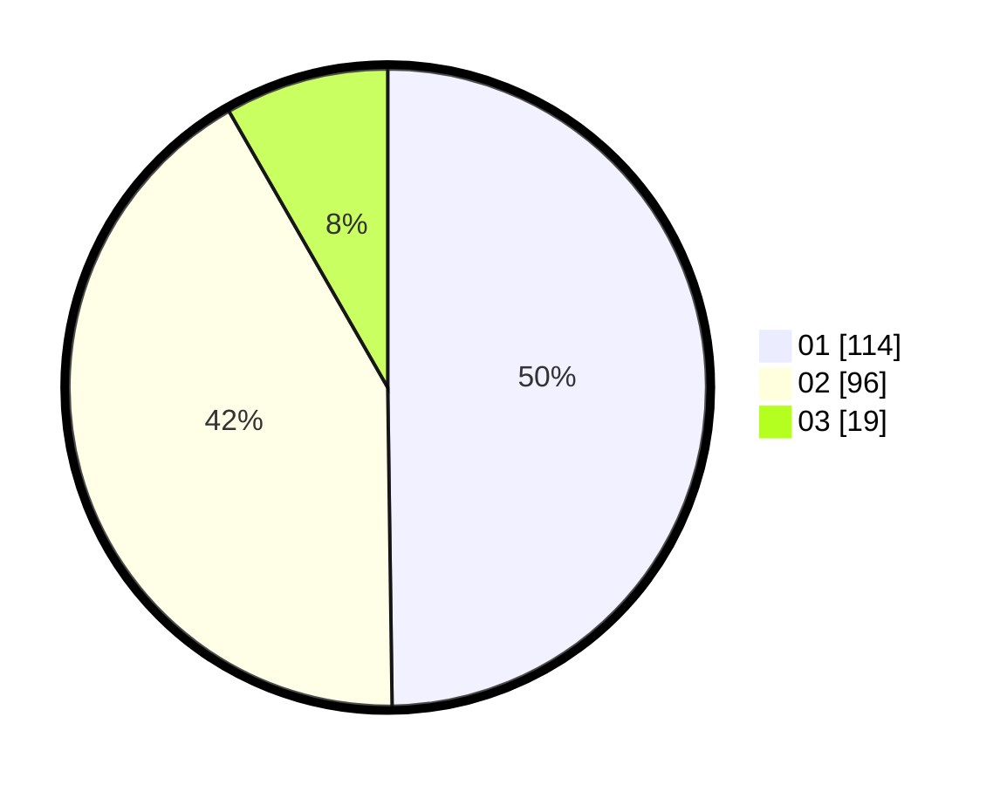

# Hasil

Hasil perolehan suara paslon dapat dilihat pada file paslon-01.txt, paslon-02.txt, dan paslon-03.txt.

Jika tidak ada, artinya data tersebut belum ada pada SIREKAP.

## Perolehan Suara

 * Paslon 01: **114**.
 * Paslon 02: **96**.
 * Paslon 03: **19**.

## Foto C Plano

https://sirekap-obj-formc.kpu.go.id/b00e/pemilu/ppwp/31/75/10/10/07/3175101007121-20240214-190029--daf7efbd-1c98-4c1d-967a-f686c871135f.jpg

https://sirekap-obj-formc.kpu.go.id/b00e/pemilu/ppwp/31/75/10/10/07/3175101007121-20240214-190040--e2f90cdd-533f-47dc-98a9-99079aa15dc4.jpg

https://sirekap-obj-formc.kpu.go.id/b00e/pemilu/ppwp/31/75/10/10/07/3175101007121-20240214-190046--b6ea06e0-c7ec-4440-b7e8-ec5524620aa9.jpg

## DATA PEMILIH TETAP

Jumlah pemilih dalam DPT: **280**.
 * L: **138**.
 * P: **142**.

## DATA PENGGUNA HAK PILIH

Jumlah pengguna hak pilih dalam DPT: **232**.
 * L: **111**.
 * P: **121**.

Jumlah pengguna hak pilih dalam DPTb: **0**.
 * L: **0**.
 * P: **0**.

Jumlah pengguna hak pilih dalam DPK: **1**.
 * L: **1**.
 * P: **0**.

Jumlah pengguna hak pilih: **233**.
 * L: **112**.
 * P: **121**.

## JUMLAH SUARA SAH DAN TIDAK SAH

JUMLAH SELURUH SUARA SAH: **229**.

JUMLAH SUARA TIDAK SAH: **4**.

JUMLAH SELURUH SUARA SAH DAN SUARA TIDAK SAH: **233**.
