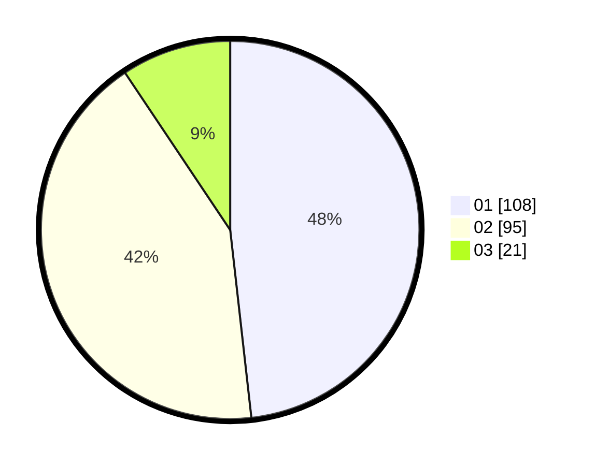

# Hasil

Hasil perolehan suara paslon dapat dilihat pada file paslon-01.txt, paslon-02.txt, dan paslon-03.txt.

Jika tidak ada, artinya data tersebut belum ada pada SIREKAP.

## Perolehan Suara

 * Paslon 01: **108**.
 * Paslon 02: **95**.
 * Paslon 03: **21**.

## Foto C Plano

https://sirekap-obj-formc.kpu.go.id/7e85/pemilu/ppwp/31/75/10/10/07/3175101007129-20240216-194928--3f53e986-172a-48a1-a68d-3ff8d3d75af0.jpg

https://sirekap-obj-formc.kpu.go.id/7e85/pemilu/ppwp/31/75/10/10/07/3175101007129-20240216-194929--041f42cf-3adb-423c-b836-7c135db8398b.jpg

https://sirekap-obj-formc.kpu.go.id/7e85/pemilu/ppwp/31/75/10/10/07/3175101007129-20240216-194928--7e7d31cb-89b0-48f8-a21b-c1d839b57c4b.jpg

## DATA PEMILIH TETAP

Jumlah pemilih dalam DPT: **271**.
 * L: **140**.
 * P: **131**.

## DATA PENGGUNA HAK PILIH

Jumlah pengguna hak pilih dalam DPT: **223**.
 * L: **108**.
 * P: **115**.

Jumlah pengguna hak pilih dalam DPTb: **3**.
 * L: **1**.
 * P: **2**.

Jumlah pengguna hak pilih dalam DPK: **1**.
 * L: **1**.
 * P: **0**.

Jumlah pengguna hak pilih: **227**.
 * L: **110**.
 * P: **117**.

## JUMLAH SUARA SAH DAN TIDAK SAH

JUMLAH SELURUH SUARA SAH: **224**.

JUMLAH SUARA TIDAK SAH: **3**.

JUMLAH SELURUH SUARA SAH DAN SUARA TIDAK SAH: **227**.
