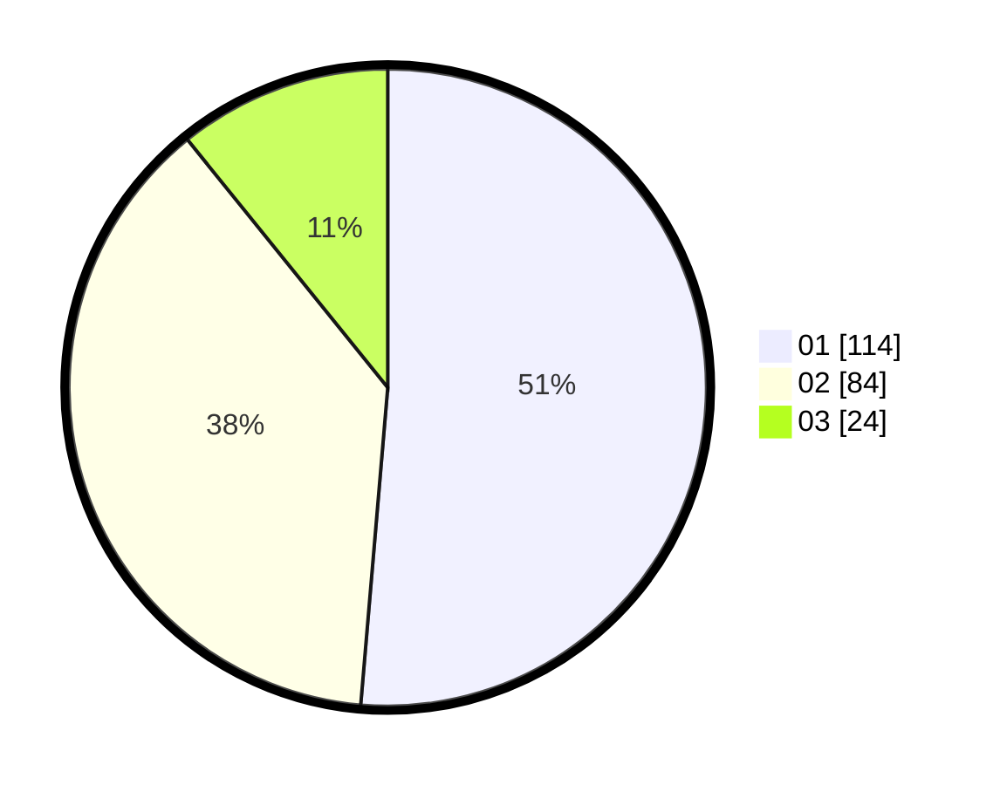

# Hasil

Hasil perolehan suara paslon dapat dilihat pada file paslon-01.txt, paslon-02.txt, dan paslon-03.txt.

Jika tidak ada, artinya data tersebut belum ada pada SIREKAP.

## Perolehan Suara

 * Paslon 01: **114**.
 * Paslon 02: **84**.
 * Paslon 03: **24**.

## Foto C Plano

https://sirekap-obj-formc.kpu.go.id/7d5b/pemilu/ppwp/31/75/10/10/07/3175101007132-20240215-193350--755c1b36-0f75-43c5-976b-62543b58c912.jpg

https://sirekap-obj-formc.kpu.go.id/7d5b/pemilu/ppwp/31/75/10/10/07/3175101007132-20240215-194140--3e01aded-caab-47d2-bef4-e2c9c2007269.jpg

https://sirekap-obj-formc.kpu.go.id/7d5b/pemilu/ppwp/31/75/10/10/07/3175101007132-20240215-194356--ac05101e-1fc3-4c0c-abd2-f41e360a1596.jpg
