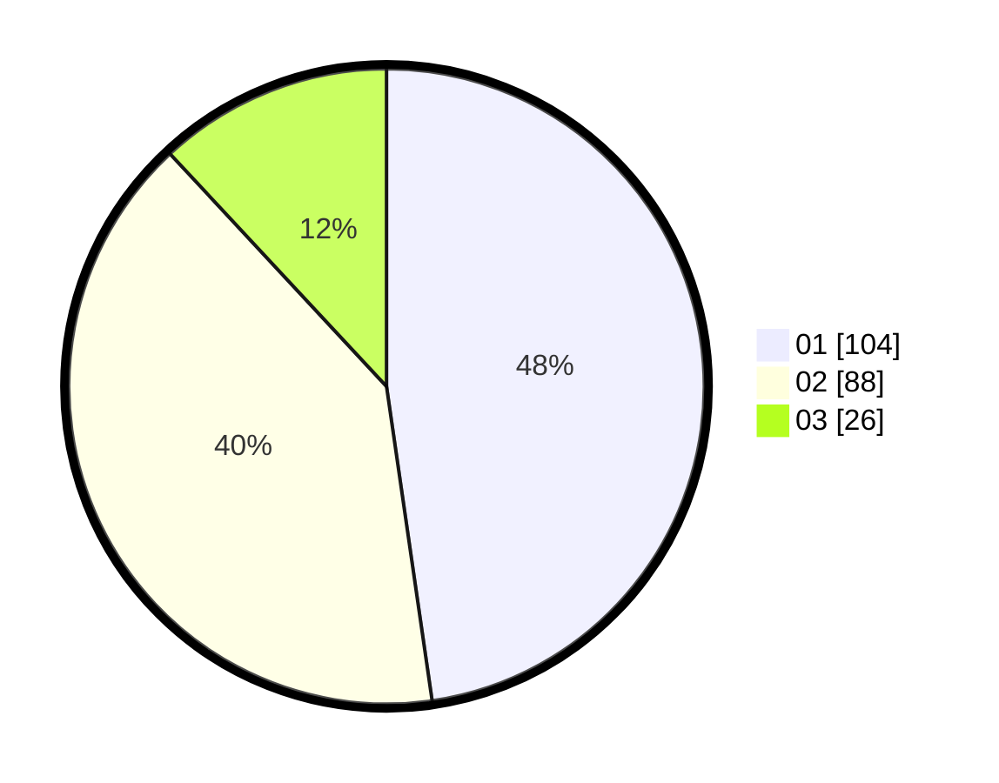

# Hasil

Hasil perolehan suara paslon dapat dilihat pada file paslon-01.txt, paslon-02.txt, dan paslon-03.txt.

Jika tidak ada, artinya data tersebut belum ada pada SIREKAP.

## Perolehan Suara

 * Paslon 01: **104**.
 * Paslon 02: **88**.
 * Paslon 03: **26**.

## Foto C Plano

https://sirekap-obj-formc.kpu.go.id/a835/pemilu/ppwp/31/75/10/10/07/3175101007136-20240216-024222--66eee98b-4556-40f4-b0a7-3fe3843f6c59.jpg

https://sirekap-obj-formc.kpu.go.id/a835/pemilu/ppwp/31/75/10/10/07/3175101007136-20240216-024223--a8c2c471-cb59-42fe-b1eb-d9e404f996e7.jpg

https://sirekap-obj-formc.kpu.go.id/a835/pemilu/ppwp/31/75/10/10/07/3175101007136-20240216-024223--6e70df1f-60ba-45aa-ae3d-4e56dcaf4e34.jpg

## DATA PEMILIH TETAP

Jumlah pemilih dalam DPT: **277**.
 * L: **132**.
 * P: **145**.

## DATA PENGGUNA HAK PILIH

Jumlah pengguna hak pilih dalam DPT: **214**.
 * L: **97**.
 * P: **117**.

Jumlah pengguna hak pilih dalam DPTb: **3**.
 * L: **1**.
 * P: **2**.

Jumlah pengguna hak pilih dalam DPK: **5**.
 * L: **0**.
 * P: **5**.

Jumlah pengguna hak pilih: **222**.
 * L: **98**.
 * P: **124**.

## JUMLAH SUARA SAH DAN TIDAK SAH

JUMLAH SELURUH SUARA SAH: **218**.

JUMLAH SUARA TIDAK SAH: **4**.

JUMLAH SELURUH SUARA SAH DAN SUARA TIDAK SAH: **222**.
