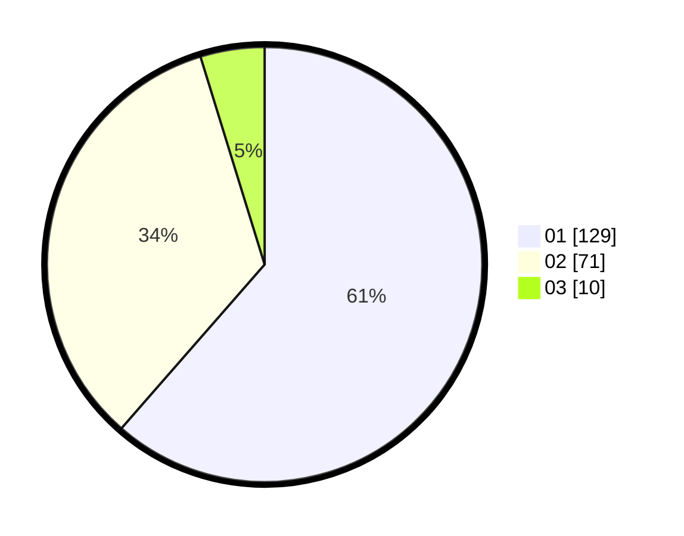

# Hasil

Hasil perolehan suara paslon dapat dilihat pada file paslon-01.txt, paslon-02.txt, dan paslon-03.txt.

Jika tidak ada, artinya data tersebut belum ada pada SIREKAP.

## Perolehan Suara

 * Paslon 01: **129**.
 * Paslon 02: **71**.
 * Paslon 03: **10**.

## Foto C Plano

https://sirekap-obj-formc.kpu.go.id/accd/pemilu/ppwp/31/75/10/10/07/3175101007137-20240216-025732--de85aecb-a48e-4514-897c-3c12340ba029.jpg

https://sirekap-obj-formc.kpu.go.id/accd/pemilu/ppwp/31/75/10/10/07/3175101007137-20240216-025740--8b4737f4-33fa-459f-8bed-c9bee4026840.jpg

https://sirekap-obj-formc.kpu.go.id/accd/pemilu/ppwp/31/75/10/10/07/3175101007137-20240216-025736--ab6aa9ff-83ab-4601-acda-7eabe11a52c5.jpg

## DATA PEMILIH TETAP

Jumlah pemilih dalam DPT: **258**.
 * L: **137**.
 * P: **121**.

## DATA PENGGUNA HAK PILIH

Jumlah pengguna hak pilih dalam DPT: **206**.
 * L: **104**.
 * P: **102**.

Jumlah pengguna hak pilih dalam DPTb: **1**.
 * L: **0**.
 * P: **1**.

Jumlah pengguna hak pilih dalam DPK: **3**.
 * L: **1**.
 * P: **2**.

Jumlah pengguna hak pilih: **210**.
 * L: **105**.
 * P: **105**.

## JUMLAH SUARA SAH DAN TIDAK SAH

JUMLAH SELURUH SUARA SAH: **210**.

JUMLAH SUARA TIDAK SAH: **0**.

JUMLAH SELURUH SUARA SAH DAN SUARA TIDAK SAH: **210**.
