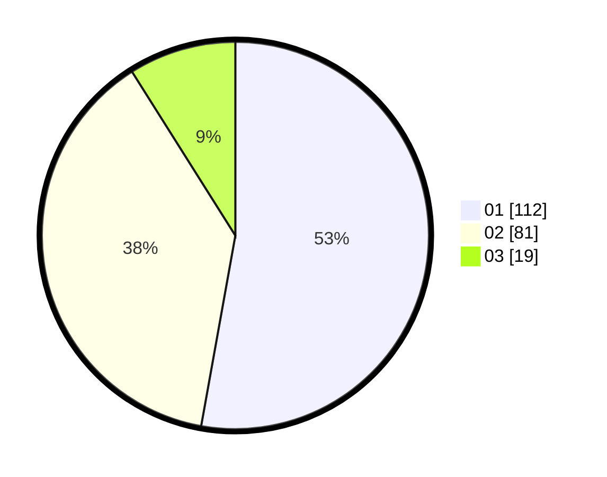

# Hasil

Hasil perolehan suara paslon dapat dilihat pada file paslon-01.txt, paslon-02.txt, dan paslon-03.txt.

Jika tidak ada, artinya data tersebut belum ada pada SIREKAP.

## Perolehan Suara

 * Paslon 01: **112**.
 * Paslon 02: **81**.
 * Paslon 03: **19**.

## Foto C Plano

https://sirekap-obj-formc.kpu.go.id/bf62/pemilu/ppwp/31/75/10/10/07/3175101007138-20240215-212616--80240ecc-7b08-487e-b899-55a9232dc531.jpg

https://sirekap-obj-formc.kpu.go.id/bf62/pemilu/ppwp/31/75/10/10/07/3175101007138-20240215-212619--8199f50c-ffd8-4bbb-a8aa-df1368b741cb.jpg

https://sirekap-obj-formc.kpu.go.id/bf62/pemilu/ppwp/31/75/10/10/07/3175101007138-20240215-212617--ed892562-f193-4826-a88a-b163e513147d.jpg

## DATA PEMILIH TETAP

Jumlah pemilih dalam DPT: **258**.
 * L: **123**.
 * P: **135**.

## DATA PENGGUNA HAK PILIH

Jumlah pengguna hak pilih dalam DPT: **213**.
 * L: **99**.
 * P: **114**.

Jumlah pengguna hak pilih dalam DPTb: **0**.
 * L: **0**.
 * P: **0**.

Jumlah pengguna hak pilih dalam DPK: **2**.
 * L: **1**.
 * P: **1**.

Jumlah pengguna hak pilih: **215**.
 * L: **100**.
 * P: **115**.

## JUMLAH SUARA SAH DAN TIDAK SAH

JUMLAH SELURUH SUARA SAH: **212**.

JUMLAH SUARA TIDAK SAH: **3**.

JUMLAH SELURUH SUARA SAH DAN SUARA TIDAK SAH: **215**.
