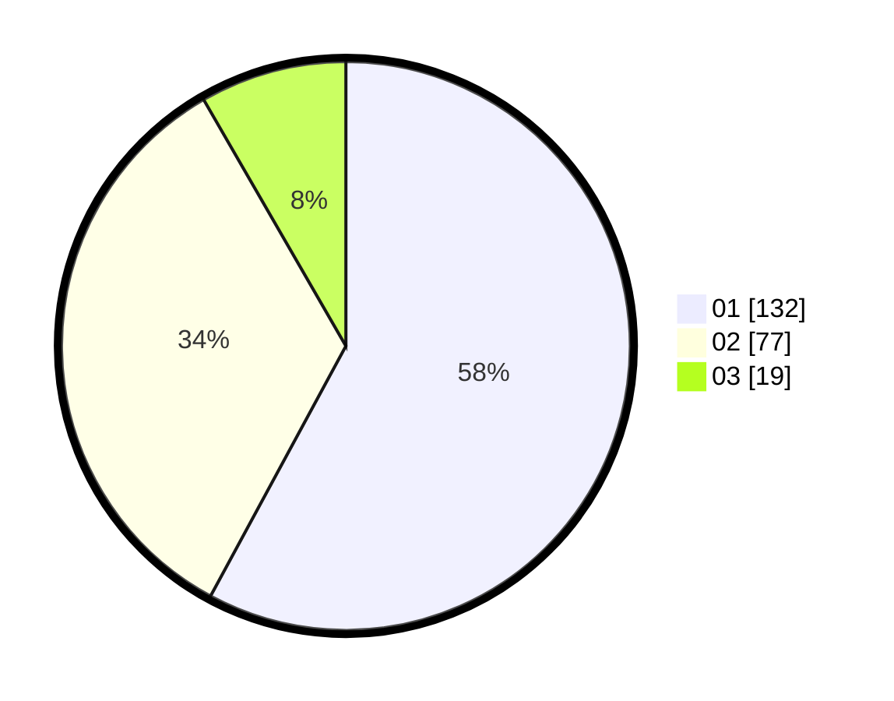

# Hasil

Hasil perolehan suara paslon dapat dilihat pada file paslon-01.txt, paslon-02.txt, dan paslon-03.txt.

Jika tidak ada, artinya data tersebut belum ada pada SIREKAP.

## Perolehan Suara

 * Paslon 01: **132**.
 * Paslon 02: **77**.
 * Paslon 03: **19**.

## Foto C Plano

https://sirekap-obj-formc.kpu.go.id/ac37/pemilu/ppwp/31/75/10/10/07/3175101007141-20240214-155442--fd0f45e0-decb-4ac6-9c72-0ca0e48bb304.jpg

https://sirekap-obj-formc.kpu.go.id/ac37/pemilu/ppwp/31/75/10/10/07/3175101007141-20240214-155458--78f92d8f-6ca1-4563-bd1b-35d213e8e5f5.jpg

https://sirekap-obj-formc.kpu.go.id/ac37/pemilu/ppwp/31/75/10/10/07/3175101007141-20240214-155523--e5019168-4b94-4631-bf5d-7a04d367085a.jpg

## DATA PEMILIH TETAP

Jumlah pemilih dalam DPT: **277**.
 * L: **128**.
 * P: **179**.

## DATA PENGGUNA HAK PILIH

Jumlah pengguna hak pilih dalam DPT: **231**.
 * L: **97**.
 * P: **134**.

Jumlah pengguna hak pilih dalam DPTb: **1**.
 * L: **0**.
 * P: **1**.

Jumlah pengguna hak pilih dalam DPK: **1**.
 * L: **1**.
 * P: **0**.

Jumlah pengguna hak pilih: **233**.
 * L: **93**.
 * P: **135**.

## JUMLAH SUARA SAH DAN TIDAK SAH

JUMLAH SELURUH SUARA SAH: **228**.

JUMLAH SUARA TIDAK SAH: **5**.

JUMLAH SELURUH SUARA SAH DAN SUARA TIDAK SAH: **233**.
