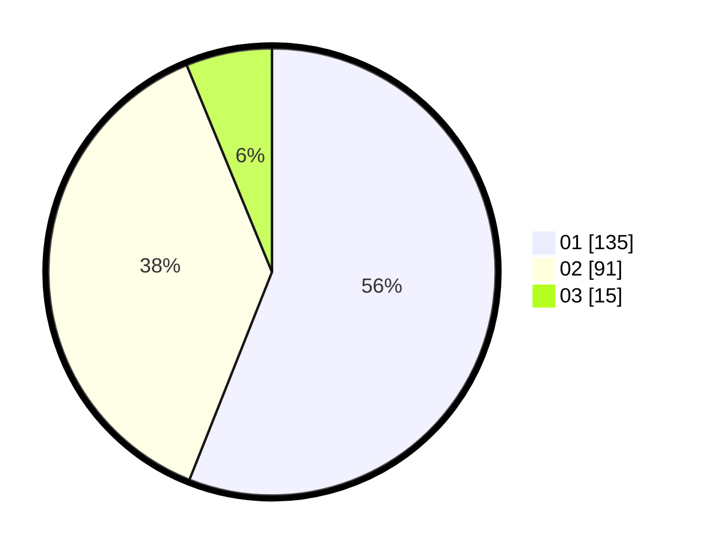

# Hasil

Hasil perolehan suara paslon dapat dilihat pada file paslon-01.txt, paslon-02.txt, dan paslon-03.txt.

Jika tidak ada, artinya data tersebut belum ada pada SIREKAP.

## Perolehan Suara

 * Paslon 01: **135**.
 * Paslon 02: **91**.
 * Paslon 03: **15**.

## Foto C Plano

https://sirekap-obj-formc.kpu.go.id/5245/pemilu/ppwp/31/75/10/10/07/3175101007142-20240216-165420--47cbaff6-b303-4739-8143-5db6477b00ac.jpg

https://sirekap-obj-formc.kpu.go.id/5245/pemilu/ppwp/31/75/10/10/07/3175101007142-20240216-165422--67634f87-8a66-4ce1-b9e2-132946267459.jpg

https://sirekap-obj-formc.kpu.go.id/5245/pemilu/ppwp/31/75/10/10/07/3175101007142-20240216-165421--e3ab19de-6d12-4699-b521-95b010a04a54.jpg

## DATA PEMILIH TETAP

Jumlah pemilih dalam DPT: **293**.
 * L: **138**.
 * P: **155**.

## DATA PENGGUNA HAK PILIH

Jumlah pengguna hak pilih dalam DPT: **239**.
 * L: **107**.
 * P: **132**.

Jumlah pengguna hak pilih dalam DPTb: **0**.
 * L: **0**.
 * P: **0**.

Jumlah pengguna hak pilih dalam DPK: **4**.
 * L: **2**.
 * P: **2**.

Jumlah pengguna hak pilih: **243**.
 * L: **109**.
 * P: **134**.

## JUMLAH SUARA SAH DAN TIDAK SAH

JUMLAH SELURUH SUARA SAH: **241**.

JUMLAH SUARA TIDAK SAH: **2**.

JUMLAH SELURUH SUARA SAH DAN SUARA TIDAK SAH: **243**.
