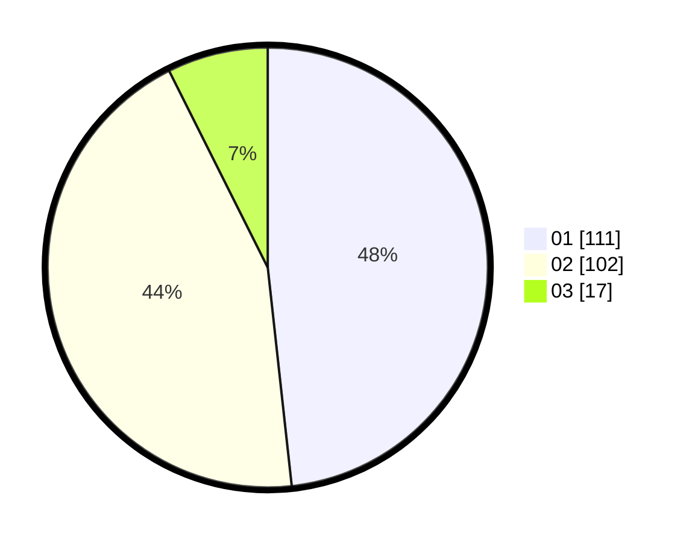

# Hasil

Hasil perolehan suara paslon dapat dilihat pada file paslon-01.txt, paslon-02.txt, dan paslon-03.txt.

Jika tidak ada, artinya data tersebut belum ada pada SIREKAP.

## Perolehan Suara

 * Paslon 01: **111**.
 * Paslon 02: **102**.
 * Paslon 03: **17**.

## Foto C Plano

https://sirekap-obj-formc.kpu.go.id/f0b1/pemilu/ppwp/31/75/10/10/07/3175101007150-20240214-232716--542ef0b9-dd1b-4ecf-b73a-f7249a493073.jpg

https://sirekap-obj-formc.kpu.go.id/f0b1/pemilu/ppwp/31/75/10/10/07/3175101007150-20240214-232855--ef4fc15a-e142-4cfb-a47d-7226be376b4d.jpg

https://sirekap-obj-formc.kpu.go.id/f0b1/pemilu/ppwp/31/75/10/10/07/3175101007150-20240214-233054--96014245-12c6-4124-be57-a3d34dfa45e4.jpg

## DATA PEMILIH TETAP

Jumlah pemilih dalam DPT: **288**.
 * L: **139**.
 * P: **149**.

## DATA PENGGUNA HAK PILIH

Jumlah pengguna hak pilih dalam DPT: **228**.
 * L: **109**.
 * P: **119**.

Jumlah pengguna hak pilih dalam DPTb: **3**.
 * L: **2**.
 * P: **1**.

Jumlah pengguna hak pilih dalam DPK: **3**.
 * L: **1**.
 * P: **2**.

Jumlah pengguna hak pilih: **234**.
 * L: **112**.
 * P: **122**.

## JUMLAH SUARA SAH DAN TIDAK SAH

JUMLAH SELURUH SUARA SAH: **230**.

JUMLAH SUARA TIDAK SAH: **4**.

JUMLAH SELURUH SUARA SAH DAN SUARA TIDAK SAH: **234**.
