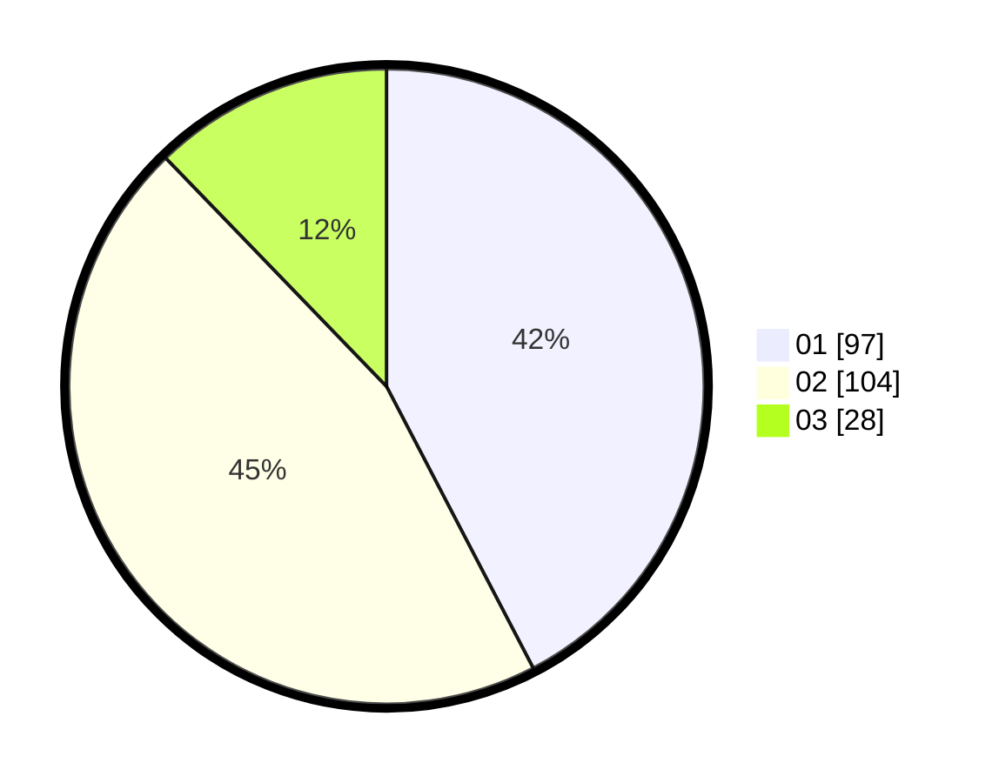

# Hasil

Hasil perolehan suara paslon dapat dilihat pada file paslon-01.txt, paslon-02.txt, dan paslon-03.txt.

Jika tidak ada, artinya data tersebut belum ada pada SIREKAP.

## Perolehan Suara

 * Paslon 01: **97**.
 * Paslon 02: **104**.
 * Paslon 03: **28**.

## Foto C Plano

https://sirekap-obj-formc.kpu.go.id/2c0c/pemilu/ppwp/31/75/10/10/07/3175101007162-20240214-191336--93b0497a-9f7f-4146-8b21-803485b3a34c.jpg

https://sirekap-obj-formc.kpu.go.id/2c0c/pemilu/ppwp/31/75/10/10/07/3175101007162-20240214-192046--5869b4e6-c40c-4229-8b70-5932f9329668.jpg

https://sirekap-obj-formc.kpu.go.id/2c0c/pemilu/ppwp/31/75/10/10/07/3175101007162-20240214-192547--2315fac3-7f49-4c10-ad0c-51269ef07d8a.jpg

## DATA PEMILIH TETAP

Jumlah pemilih dalam DPT: **291**.
 * L: **153**.
 * P: **138**.

## DATA PENGGUNA HAK PILIH

Jumlah pengguna hak pilih dalam DPT: **230**.
 * L: **119**.
 * P: **111**.

Jumlah pengguna hak pilih dalam DPTb: **0**.
 * L: **0**.
 * P: **0**.

Jumlah pengguna hak pilih dalam DPK: **1**.
 * L: **0**.
 * P: **1**.

Jumlah pengguna hak pilih: **231**.
 * L: **272**.
 * P: **52**.

## JUMLAH SUARA SAH DAN TIDAK SAH

JUMLAH SELURUH SUARA SAH: **229**.

JUMLAH SUARA TIDAK SAH: **2**.

JUMLAH SELURUH SUARA SAH DAN SUARA TIDAK SAH: **231**.
