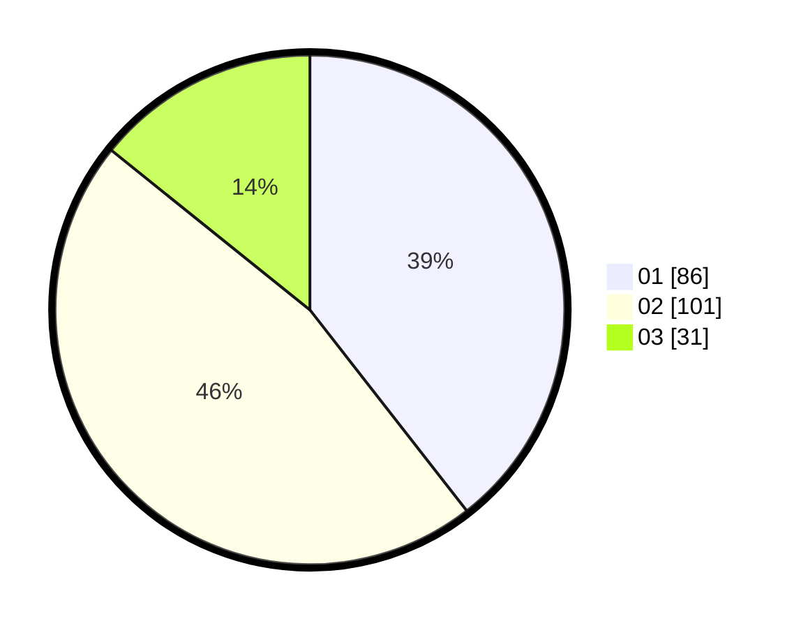

# Hasil

Hasil perolehan suara paslon dapat dilihat pada file paslon-01.txt, paslon-02.txt, dan paslon-03.txt.

Jika tidak ada, artinya data tersebut belum ada pada SIREKAP.

## Perolehan Suara

 * Paslon 01: **86**.
 * Paslon 02: **101**.
 * Paslon 03: **31**.

## Foto C Plano

https://sirekap-obj-formc.kpu.go.id/269d/pemilu/ppwp/31/75/10/10/07/3175101007166-20240214-214231--7fcde54f-7a73-42d3-bc4d-202f60aecad9.jpg

https://sirekap-obj-formc.kpu.go.id/269d/pemilu/ppwp/31/75/10/10/07/3175101007166-20240214-214512--61549520-c0a2-45fd-89ae-358e91452612.jpg

https://sirekap-obj-formc.kpu.go.id/269d/pemilu/ppwp/31/75/10/10/07/3175101007166-20240214-214750--ae5a3fe5-3e1e-4ae7-a3c7-abb19f9d285b.jpg

## DATA PEMILIH TETAP

Jumlah pemilih dalam DPT: **262**.
 * L: **133**.
 * P: **129**.

## DATA PENGGUNA HAK PILIH

Jumlah pengguna hak pilih dalam DPT: **215**.
 * L: **108**.
 * P: **107**.

Jumlah pengguna hak pilih dalam DPTb: **0**.
 * L: **0**.
 * P: **0**.

Jumlah pengguna hak pilih dalam DPK: **8**.
 * L: **4**.
 * P: **4**.

Jumlah pengguna hak pilih: **223**.
 * L: **112**.
 * P: **111**.

## JUMLAH SUARA SAH DAN TIDAK SAH

JUMLAH SELURUH SUARA SAH: **218**.

JUMLAH SUARA TIDAK SAH: **5**.

JUMLAH SELURUH SUARA SAH DAN SUARA TIDAK SAH: **223**.
