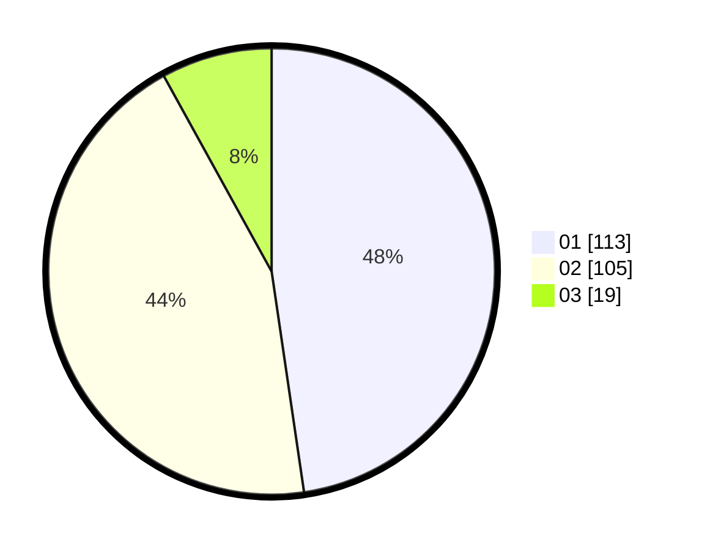

# Hasil

Hasil perolehan suara paslon dapat dilihat pada file paslon-01.txt, paslon-02.txt, dan paslon-03.txt.

Jika tidak ada, artinya data tersebut belum ada pada SIREKAP.

## Perolehan Suara

 * Paslon 01: **113**.
 * Paslon 02: **105**.
 * Paslon 03: **19**.

## Foto C Plano

https://sirekap-obj-formc.kpu.go.id/24be/pemilu/ppwp/31/75/10/10/07/3175101007180-20240214-222402--78498638-31fb-4c11-97d3-0a21ec6ca4bd.jpg

https://sirekap-obj-formc.kpu.go.id/24be/pemilu/ppwp/31/75/10/10/07/3175101007180-20240214-203610--1b5eaf35-85fc-4a4b-82f6-64e8ed12c01a.jpg

https://sirekap-obj-formc.kpu.go.id/24be/pemilu/ppwp/31/75/10/10/07/3175101007180-20240214-222532--efc4aa23-dbb4-4c00-a7c5-ee1f6ca56cbf.jpg
