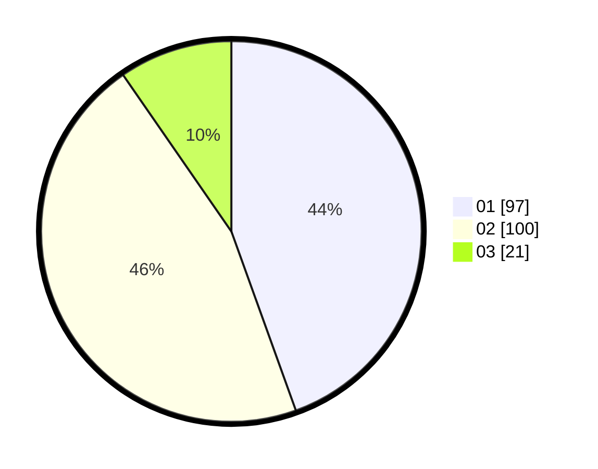

# Hasil

Hasil perolehan suara paslon dapat dilihat pada file paslon-01.txt, paslon-02.txt, dan paslon-03.txt.

Jika tidak ada, artinya data tersebut belum ada pada SIREKAP.

## Perolehan Suara

 * Paslon 01: **97**.
 * Paslon 02: **100**.
 * Paslon 03: **21**.

## Foto C Plano

https://sirekap-obj-formc.kpu.go.id/de78/pemilu/ppwp/31/75/10/10/07/3175101007181-20240214-233108--08cc450a-b0a4-4261-8525-b54a0243a7f2.jpg

https://sirekap-obj-formc.kpu.go.id/de78/pemilu/ppwp/31/75/10/10/07/3175101007181-20240214-233303--441ddcdf-ef04-4f25-878d-52dcd4835b67.jpg

https://sirekap-obj-formc.kpu.go.id/de78/pemilu/ppwp/31/75/10/10/07/3175101007181-20240214-233435--e5b682c9-34aa-43b3-b4f5-001164958df7.jpg
