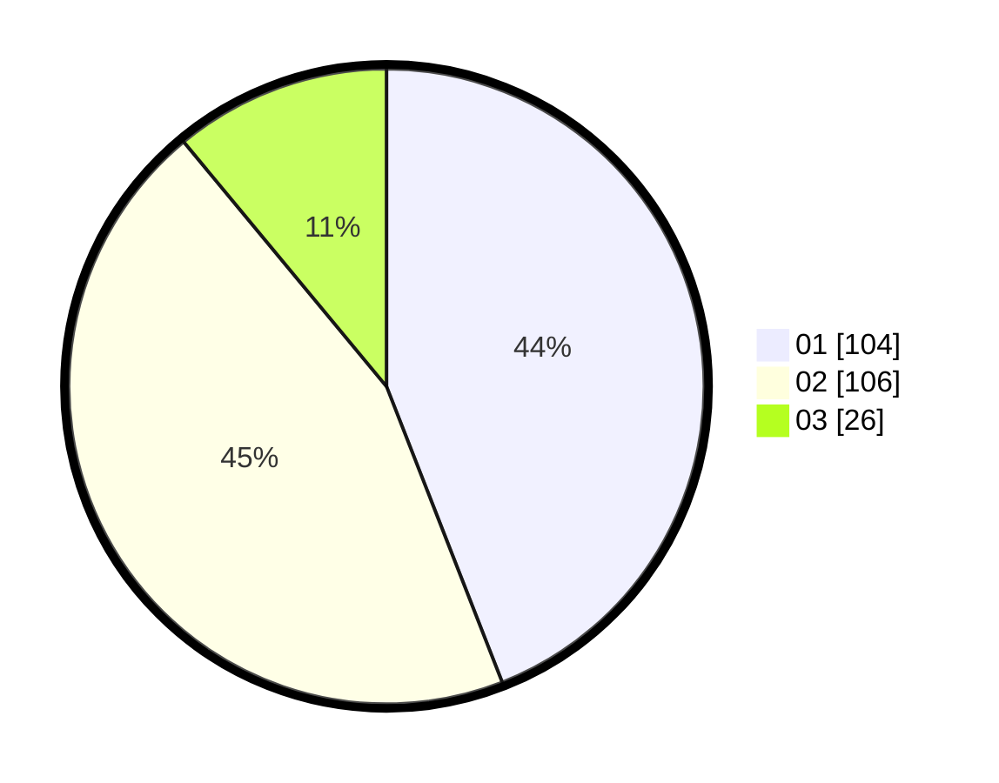

# Hasil

Hasil perolehan suara paslon dapat dilihat pada file paslon-01.txt, paslon-02.txt, dan paslon-03.txt.

Jika tidak ada, artinya data tersebut belum ada pada SIREKAP.

## Perolehan Suara

 * Paslon 01: **104**.
 * Paslon 02: **106**.
 * Paslon 03: **26**.

## Foto C Plano

https://sirekap-obj-formc.kpu.go.id/bf53/pemilu/ppwp/31/75/10/10/07/3175101007189-20240214-155109--7696a949-ffe8-401f-8285-3ee5a957a5ad.jpg

https://sirekap-obj-formc.kpu.go.id/bf53/pemilu/ppwp/31/75/10/10/07/3175101007189-20240214-155049--02051a39-f9e4-4d87-981f-b86e59d1a3f3.jpg

https://sirekap-obj-formc.kpu.go.id/bf53/pemilu/ppwp/31/75/10/10/07/3175101007189-20240214-155025--d351791f-0ba5-4f8f-b55d-e04bce80a3f8.jpg

## DATA PEMILIH TETAP

Jumlah pemilih dalam DPT: **286**.
 * L: **128**.
 * P: **158**.

## DATA PENGGUNA HAK PILIH

Jumlah pengguna hak pilih dalam DPT: **237**.
 * L: **108**.
 * P: **129**.

Jumlah pengguna hak pilih dalam DPTb: **0**.
 * L: **0**.
 * P: **0**.

Jumlah pengguna hak pilih dalam DPK: **2**.
 * L: **1**.
 * P: **1**.

Jumlah pengguna hak pilih: **239**.
 * L: **109**.
 * P: **130**.

## JUMLAH SUARA SAH DAN TIDAK SAH

JUMLAH SELURUH SUARA SAH: **236**.

JUMLAH SUARA TIDAK SAH: **3**.

JUMLAH SELURUH SUARA SAH DAN SUARA TIDAK SAH: **239**.
