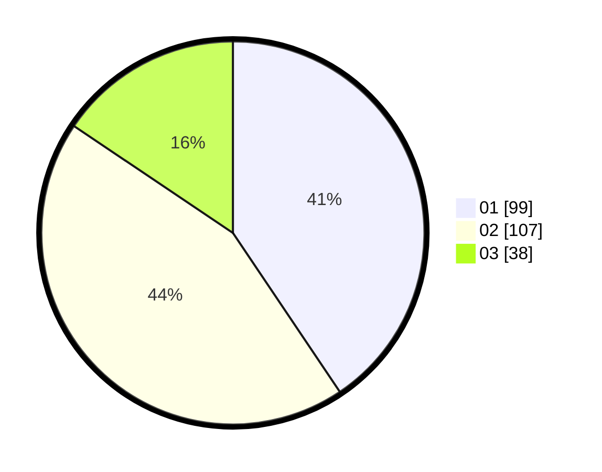

# Hasil

Hasil perolehan suara paslon dapat dilihat pada file paslon-01.txt, paslon-02.txt, dan paslon-03.txt.

Jika tidak ada, artinya data tersebut belum ada pada SIREKAP.

## Perolehan Suara

 * Paslon 01: **99**.
 * Paslon 02: **107**.
 * Paslon 03: **38**.

## Foto C Plano

https://sirekap-obj-formc.kpu.go.id/1cf6/pemilu/ppwp/31/75/10/10/07/3175101007191-20240216-160747--c96c52ff-7908-4e3e-8c1a-30e32866bc6e.jpg

https://sirekap-obj-formc.kpu.go.id/1cf6/pemilu/ppwp/31/75/10/10/07/3175101007191-20240216-160748--920eddfe-48ee-4d25-9556-c74a0e3efca8.jpg

https://sirekap-obj-formc.kpu.go.id/1cf6/pemilu/ppwp/31/75/10/10/07/3175101007191-20240216-160748--6673479e-c29f-4e02-b980-4c021ac8d679.jpg

## DATA PEMILIH TETAP

Jumlah pemilih dalam DPT: **292**.
 * L: **136**.
 * P: **156**.

## DATA PENGGUNA HAK PILIH

Jumlah pengguna hak pilih dalam DPT: **245**.
 * L: **110**.
 * P: **135**.

Jumlah pengguna hak pilih dalam DPTb: **0**.
 * L: **0**.
 * P: **0**.

Jumlah pengguna hak pilih dalam DPK: **3**.
 * L: **1**.
 * P: **2**.

Jumlah pengguna hak pilih: **248**.
 * L: **111**.
 * P: **137**.

## JUMLAH SUARA SAH DAN TIDAK SAH

JUMLAH SELURUH SUARA SAH: **244**.

JUMLAH SUARA TIDAK SAH: **4**.

JUMLAH SELURUH SUARA SAH DAN SUARA TIDAK SAH: **248**.
