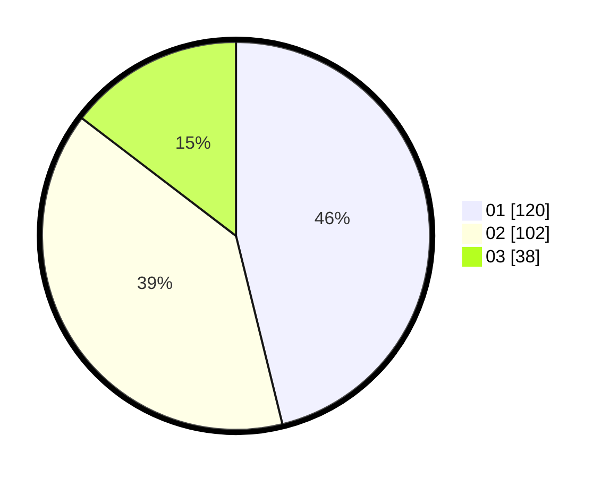

# Hasil

Hasil perolehan suara paslon dapat dilihat pada file paslon-01.txt, paslon-02.txt, dan paslon-03.txt.

Jika tidak ada, artinya data tersebut belum ada pada SIREKAP.

## Perolehan Suara

 * Paslon 01: **120**.
 * Paslon 02: **102**.
 * Paslon 03: **38**.

## Foto C Plano

https://sirekap-obj-formc.kpu.go.id/b359/pemilu/ppwp/31/75/10/10/07/3175101007192-20240214-210124--7c55714d-dfec-4488-9d77-a674d5319a18.jpg

https://sirekap-obj-formc.kpu.go.id/b359/pemilu/ppwp/31/75/10/10/07/3175101007192-20240214-210141--7dea829c-59ff-4669-ae8a-14b288f2bff3.jpg

https://sirekap-obj-formc.kpu.go.id/b359/pemilu/ppwp/31/75/10/10/07/3175101007192-20240214-210155--69c236f6-6e9d-46a5-a728-bbf3cd9aeffd.jpg

## DATA PEMILIH TETAP

Jumlah pemilih dalam DPT: **293**.
 * L: **148**.
 * P: **145**.

## DATA PENGGUNA HAK PILIH

Jumlah pengguna hak pilih dalam DPT: **261**.
 * L: **129**.
 * P: **132**.

Jumlah pengguna hak pilih dalam DPTb: **3**.
 * L: **2**.
 * P: **1**.

Jumlah pengguna hak pilih dalam DPK: **0**.
 * L: **0**.
 * P: **0**.

Jumlah pengguna hak pilih: **264**.
 * L: **131**.
 * P: **133**.

## JUMLAH SUARA SAH DAN TIDAK SAH

JUMLAH SELURUH SUARA SAH: **260**.

JUMLAH SUARA TIDAK SAH: **4**.

JUMLAH SELURUH SUARA SAH DAN SUARA TIDAK SAH: **264**.
