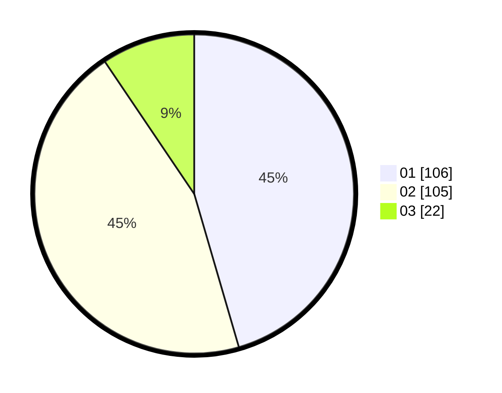

# Hasil

Hasil perolehan suara paslon dapat dilihat pada file paslon-01.txt, paslon-02.txt, dan paslon-03.txt.

Jika tidak ada, artinya data tersebut belum ada pada SIREKAP.

## Perolehan Suara

 * Paslon 01: **106**.
 * Paslon 02: **105**.
 * Paslon 03: **22**.

## Foto C Plano

https://sirekap-obj-formc.kpu.go.id/b7a4/pemilu/ppwp/31/75/10/10/07/3175101007194-20240216-145628--cdd52409-8be1-495d-ac2a-624d4aaabf4e.jpg

https://sirekap-obj-formc.kpu.go.id/b7a4/pemilu/ppwp/31/75/10/10/07/3175101007194-20240216-145630--5d7c88c3-9070-4f6f-992f-f47cd2cfa607.jpg

https://sirekap-obj-formc.kpu.go.id/b7a4/pemilu/ppwp/31/75/10/10/07/3175101007194-20240216-145629--a7c5b91c-decf-4a24-ac82-daae3ca068c4.jpg

## DATA PEMILIH TETAP

Jumlah pemilih dalam DPT: **292**.
 * L: **144**.
 * P: **148**.

## DATA PENGGUNA HAK PILIH

Jumlah pengguna hak pilih dalam DPT: **234**.
 * L: **111**.
 * P: **123**.

Jumlah pengguna hak pilih dalam DPTb: **3**.
 * L: **2**.
 * P: **1**.

Jumlah pengguna hak pilih dalam DPK: **2**.
 * L: **1**.
 * P: **1**.

Jumlah pengguna hak pilih: **239**.
 * L: **114**.
 * P: **125**.

## JUMLAH SUARA SAH DAN TIDAK SAH

JUMLAH SELURUH SUARA SAH: **233**.

JUMLAH SUARA TIDAK SAH: **6**.

JUMLAH SELURUH SUARA SAH DAN SUARA TIDAK SAH: **239**.
