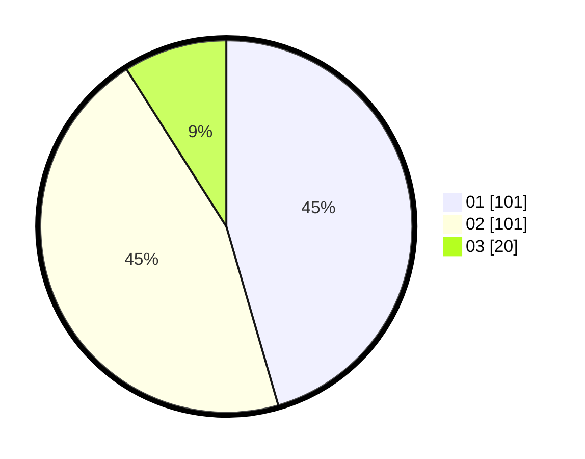

# Hasil

Hasil perolehan suara paslon dapat dilihat pada file paslon-01.txt, paslon-02.txt, dan paslon-03.txt.

Jika tidak ada, artinya data tersebut belum ada pada SIREKAP.

## Perolehan Suara

 * Paslon 01: **101**.
 * Paslon 02: **101**.
 * Paslon 03: **20**.

## Foto C Plano

https://sirekap-obj-formc.kpu.go.id/15a7/pemilu/ppwp/31/75/10/10/07/3175101007197-20240214-155044--d904a1cb-0c33-40fc-b48b-78d3980fb384.jpg

https://sirekap-obj-formc.kpu.go.id/15a7/pemilu/ppwp/31/75/10/10/07/3175101007197-20240214-155247--bd73e470-0f8e-4752-8a07-0551f89b1a18.jpg

https://sirekap-obj-formc.kpu.go.id/15a7/pemilu/ppwp/31/75/10/10/07/3175101007197-20240214-155814--7b10b861-f38a-43dc-beb6-753215f8b938.jpg
