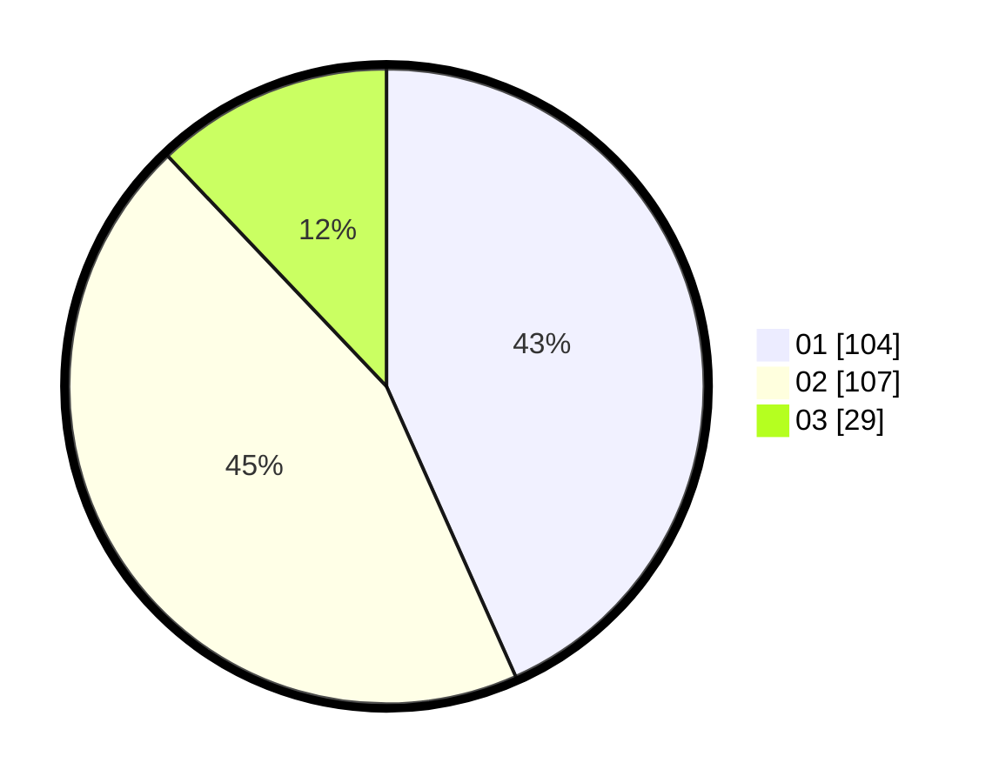

# Hasil

Hasil perolehan suara paslon dapat dilihat pada file paslon-01.txt, paslon-02.txt, dan paslon-03.txt.

Jika tidak ada, artinya data tersebut belum ada pada SIREKAP.

## Perolehan Suara

 * Paslon 01: **104**.
 * Paslon 02: **107**.
 * Paslon 03: **29**.

## Foto C Plano

https://sirekap-obj-formc.kpu.go.id/12e2/pemilu/ppwp/31/75/10/10/07/3175101007199-20240215-002531--97a49619-b072-4d6f-8ee7-0cf4b7c33318.jpg

https://sirekap-obj-formc.kpu.go.id/12e2/pemilu/ppwp/31/75/10/10/07/3175101007199-20240215-002606--6e815e94-3a2f-4160-b611-a0f3e56363e0.jpg

https://sirekap-obj-formc.kpu.go.id/12e2/pemilu/ppwp/31/75/10/10/07/3175101007199-20240215-002638--9a0ce56b-5a00-46e5-96d3-e54fd840ff43.jpg

## DATA PEMILIH TETAP

Jumlah pemilih dalam DPT: **272**.
 * L: **133**.
 * P: **139**.

## DATA PENGGUNA HAK PILIH

Jumlah pengguna hak pilih dalam DPT: **242**.
 * L: **121**.
 * P: **121**.

Jumlah pengguna hak pilih dalam DPTb: **0**.
 * L: **0**.
 * P: **0**.

Jumlah pengguna hak pilih dalam DPK: **1**.
 * L: **1**.
 * P: **0**.

Jumlah pengguna hak pilih: **243**.
 * L: **122**.
 * P: **121**.

## JUMLAH SUARA SAH DAN TIDAK SAH

JUMLAH SELURUH SUARA SAH: **240**.

JUMLAH SUARA TIDAK SAH: **3**.

JUMLAH SELURUH SUARA SAH DAN SUARA TIDAK SAH: **243**.
