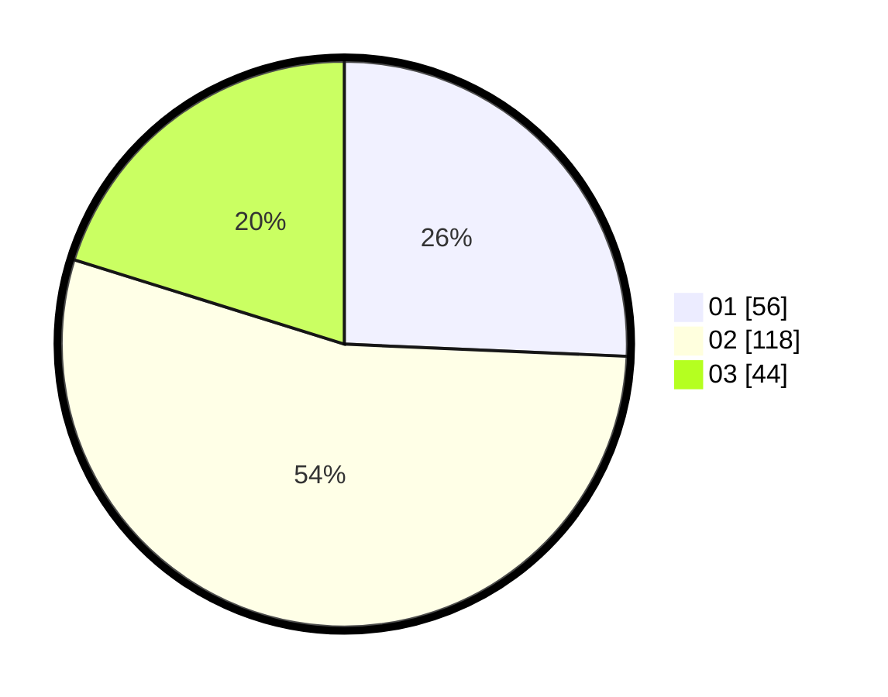

# Hasil

Hasil perolehan suara paslon dapat dilihat pada file paslon-01.txt, paslon-02.txt, dan paslon-03.txt.

Jika tidak ada, artinya data tersebut belum ada pada SIREKAP.

## Perolehan Suara

 * Paslon 01: **56**.
 * Paslon 02: **118**.
 * Paslon 03: **44**.

## Foto C Plano

https://sirekap-obj-formc.kpu.go.id/0119/pemilu/ppwp/31/75/10/10/07/3175101007204-20240216-002323--c4dc83a9-1847-4a23-98c5-c8e7ebe83a24.jpg

https://sirekap-obj-formc.kpu.go.id/0119/pemilu/ppwp/31/75/10/10/07/3175101007204-20240216-002326--2608d845-b8c7-449d-8783-c22b4f4f0c7e.jpg

https://sirekap-obj-formc.kpu.go.id/0119/pemilu/ppwp/31/75/10/10/07/3175101007204-20240216-002325--a3cb4ca9-e48d-4c3c-a73a-8642bd975b60.jpg

## DATA PEMILIH TETAP

Jumlah pemilih dalam DPT: **255**.
 * L: **126**.
 * P: **129**.

## DATA PENGGUNA HAK PILIH

Jumlah pengguna hak pilih dalam DPT: **222**.
 * L: **106**.
 * P: **116**.

Jumlah pengguna hak pilih dalam DPTb: **0**.
 * L: **0**.
 * P: **0**.

Jumlah pengguna hak pilih dalam DPK: **3**.
 * L: **1**.
 * P: **2**.

Jumlah pengguna hak pilih: **225**.
 * L: **107**.
 * P: **118**.

## JUMLAH SUARA SAH DAN TIDAK SAH

JUMLAH SELURUH SUARA SAH: **218**.

JUMLAH SUARA TIDAK SAH: **7**.

JUMLAH SELURUH SUARA SAH DAN SUARA TIDAK SAH: **225**.
