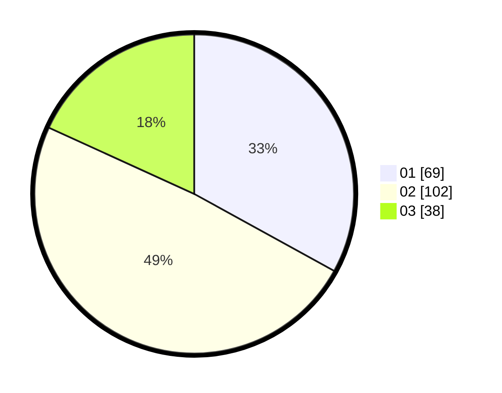

# Hasil

Hasil perolehan suara paslon dapat dilihat pada file paslon-01.txt, paslon-02.txt, dan paslon-03.txt.

Jika tidak ada, artinya data tersebut belum ada pada SIREKAP.

## Perolehan Suara

 * Paslon 01: **69**.
 * Paslon 02: **102**.
 * Paslon 03: **38**.

## Foto C Plano

https://sirekap-obj-formc.kpu.go.id/bb53/pemilu/ppwp/31/75/10/10/07/3175101007205-20240216-000329--3f09be18-72f4-4e3d-82a7-96e055d1af92.jpg

https://sirekap-obj-formc.kpu.go.id/bb53/pemilu/ppwp/31/75/10/10/07/3175101007205-20240216-000331--13eeceef-384f-4790-a347-e26091af2470.jpg

https://sirekap-obj-formc.kpu.go.id/bb53/pemilu/ppwp/31/75/10/10/07/3175101007205-20240216-000330--18a185ee-daf6-401d-810c-c7d19cc05e8f.jpg

## DATA PEMILIH TETAP

Jumlah pemilih dalam DPT: **252**.
 * L: **132**.
 * P: **120**.

## DATA PENGGUNA HAK PILIH

Jumlah pengguna hak pilih dalam DPT: **207**.
 * L: **108**.
 * P: **99**.

Jumlah pengguna hak pilih dalam DPTb: **2**.
 * L: **1**.
 * P: **1**.

Jumlah pengguna hak pilih dalam DPK: **1**.
 * L: **1**.
 * P: **0**.

Jumlah pengguna hak pilih: **210**.
 * L: **110**.
 * P: **100**.

## JUMLAH SUARA SAH DAN TIDAK SAH

JUMLAH SELURUH SUARA SAH: **209**.

JUMLAH SUARA TIDAK SAH: **1**.

JUMLAH SELURUH SUARA SAH DAN SUARA TIDAK SAH: **210**.
