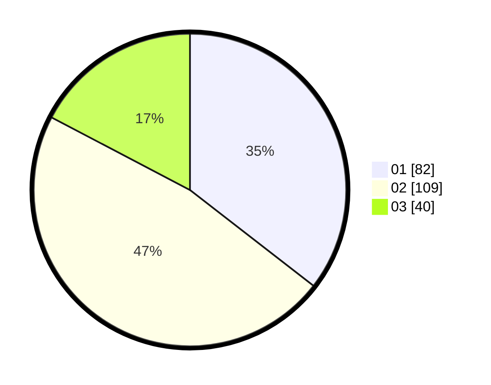

# Hasil

Hasil perolehan suara paslon dapat dilihat pada file paslon-01.txt, paslon-02.txt, dan paslon-03.txt.

Jika tidak ada, artinya data tersebut belum ada pada SIREKAP.

## Perolehan Suara

 * Paslon 01: **82**.
 * Paslon 02: **109**.
 * Paslon 03: **40**.

## Foto C Plano

https://sirekap-obj-formc.kpu.go.id/2889/pemilu/ppwp/31/75/10/10/07/3175101007209-20240216-012944--ad4bca1e-ab70-460d-b8c4-5809298e96ef.jpg

https://sirekap-obj-formc.kpu.go.id/2889/pemilu/ppwp/31/75/10/10/07/3175101007209-20240215-221446--eb74ec3b-291f-42e8-a47d-2703a4917e4b.jpg

https://sirekap-obj-formc.kpu.go.id/2889/pemilu/ppwp/31/75/10/10/07/3175101007209-20240216-012951--f8b678b4-e5ab-4fd9-a369-2dda4d7835d5.jpg

## DATA PEMILIH TETAP

Jumlah pemilih dalam DPT: **292**.
 * L: **145**.
 * P: **147**.

## DATA PENGGUNA HAK PILIH

Jumlah pengguna hak pilih dalam DPT: **235**.
 * L: **116**.
 * P: **119**.

Jumlah pengguna hak pilih dalam DPTb: **0**.
 * L: **0**.
 * P: **0**.

Jumlah pengguna hak pilih dalam DPK: **3**.
 * L: **1**.
 * P: **2**.

Jumlah pengguna hak pilih: **238**.
 * L: **117**.
 * P: **121**.

## JUMLAH SUARA SAH DAN TIDAK SAH

JUMLAH SELURUH SUARA SAH: **231**.

JUMLAH SUARA TIDAK SAH: **7**.

JUMLAH SELURUH SUARA SAH DAN SUARA TIDAK SAH: **238**.
