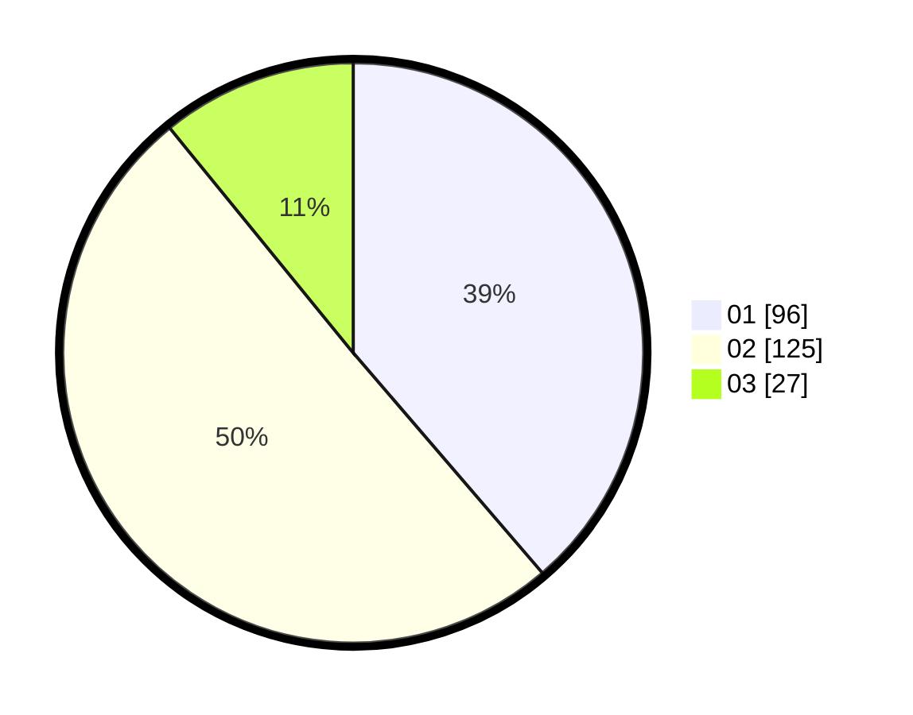

# Hasil

Hasil perolehan suara paslon dapat dilihat pada file paslon-01.txt, paslon-02.txt, dan paslon-03.txt.

Jika tidak ada, artinya data tersebut belum ada pada SIREKAP.

## Perolehan Suara

 * Paslon 01: **96**.
 * Paslon 02: **125**.
 * Paslon 03: **27**.

## Foto C Plano

https://sirekap-obj-formc.kpu.go.id/b0b3/pemilu/ppwp/31/75/10/10/07/3175101007213-20240215-062341--cd2ad56f-2c38-44f4-863b-bc428ae2a65e.jpg

https://sirekap-obj-formc.kpu.go.id/b0b3/pemilu/ppwp/31/75/10/10/07/3175101007213-20240215-062402--d5bb8db7-3da0-4eff-a962-bf0aabcebd66.jpg

https://sirekap-obj-formc.kpu.go.id/b0b3/pemilu/ppwp/31/75/10/10/07/3175101007213-20240215-062351--9f787602-de1a-4c89-83d1-3d3c78dcf463.jpg

## DATA PEMILIH TETAP

Jumlah pemilih dalam DPT: **298**.
 * L: **148**.
 * P: **150**.

## DATA PENGGUNA HAK PILIH

Jumlah pengguna hak pilih dalam DPT: **250**.
 * L: **120**.
 * P: **130**.

Jumlah pengguna hak pilih dalam DPTb: **2**.
 * L: **1**.
 * P: **1**.

Jumlah pengguna hak pilih dalam DPK: **2**.
 * L: **0**.
 * P: **2**.

Jumlah pengguna hak pilih: **254**.
 * L: **121**.
 * P: **133**.

## JUMLAH SUARA SAH DAN TIDAK SAH

JUMLAH SELURUH SUARA SAH: **248**.

JUMLAH SUARA TIDAK SAH: **6**.

JUMLAH SELURUH SUARA SAH DAN SUARA TIDAK SAH: **254**.
